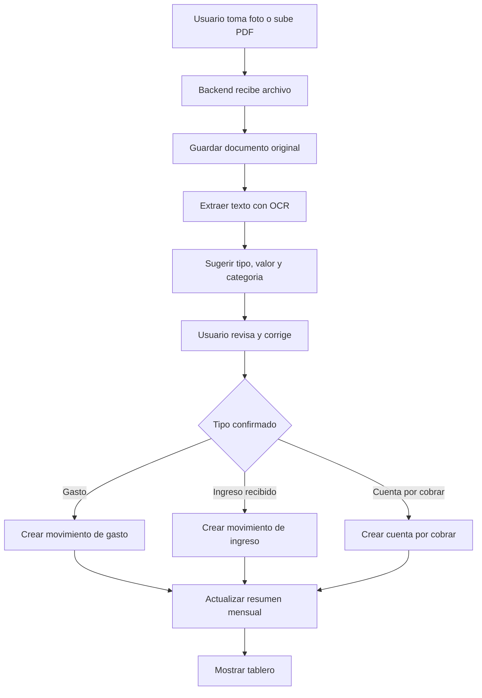
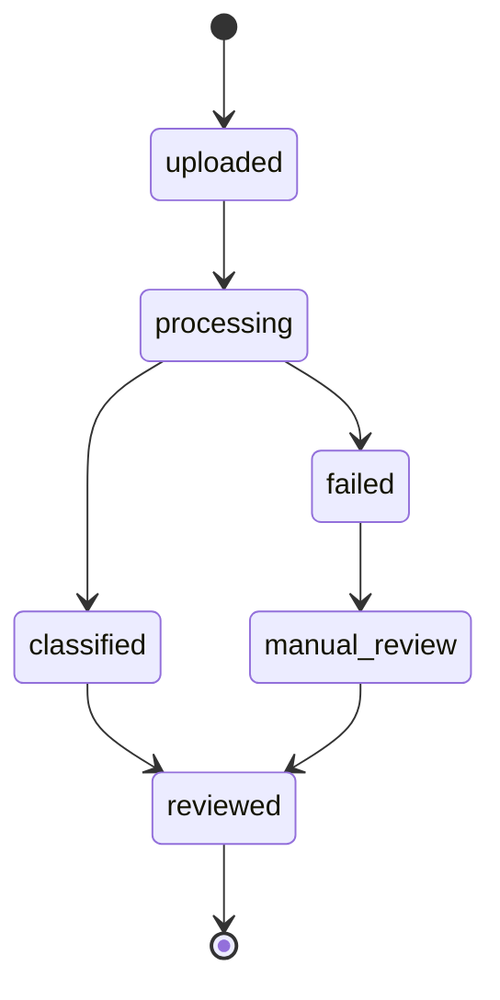

# MVP y flujo de usuario

## Alcance del MVP

La primera version debe probar si el usuario quiere ordenar su negocio desde fotos.

Incluye:

- Crear cuenta e iniciar sesion.
- Subir o tomar foto, tambien PDF.
- Leer texto con OCR.
- Mostrar una revision simple antes de guardar.
- Clasificar como gasto, ingreso o cobro.
- Guardar fecha estimada de pago.
- Mostrar resumen mensual simple.

No incluye todavia:

- App nativa movil.
- Integracion real de pagos.
- Contabilidad avanzada.
- Conciliacion bancaria.
- Recordatorios por WhatsApp/SMS.

## Flujo principal

## Primera pantalla del producto

La experiencia inicial debe girar alrededor de cuatro acciones:

- Tomar foto o subir PDF.
- Revisar lo que leyo la app.
- Confirmar tipo: gasto, ingreso o cobro.
- Guardar fecha de pago si aplica.
- Ver tablero mensual.

## Estados del documento

## Reglas de clasificacion inicial

El MVP puede iniciar con reglas simples:

- Si el texto contiene gasolina, combustible, galon, Terpel, Primax o Texaco: gasto de combustible.
- Si contiene peaje, estacion o caseta: gasto de peaje.
- Si contiene mantenimiento, aceite, llanta o taller: gasto de mantenimiento.
- Si contiene remesa, manifiesto, guia o flete: ingreso o cuenta por cobrar.
- Si contiene cuenta de cobro, factura, pagar, vence o cliente: cuenta por cobrar.

Estas reglas se pueden reemplazar despues por un modelo de clasificacion.
