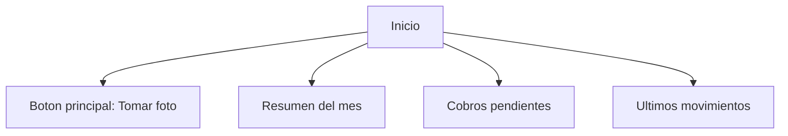
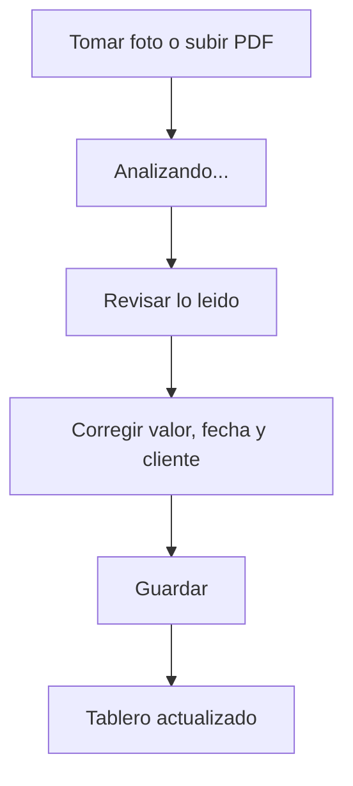
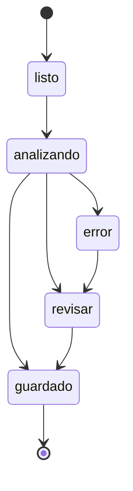

# Diseno sobrio y facil para Rumbo

## Principio central

La app no debe sentirse como contabilidad. Debe sentirse como una herramienta de trabajo diaria para alguien que esta en la calle, con prisa y usando el celular con una mano.

Promesa visible:

> Toma una foto y tu negocio queda en orden.

## Personalidad visual

- Sobria.
- Clara.
- Rapida.
- Confiable.
- Sin adornos innecesarios.
- Sin lenguaje contable pesado.

## Primera pantalla



La primera pantalla debe mostrar:

- Boton principal grande: `Tomar foto`.
- Dinero del mes: entro, salio, queda.
- Cobros pendientes: cantidad y valor.
- Lista corta de ultimos registros.

No debe mostrar:

- Graficos complejos al inicio.
- Muchas tarjetas.
- Texto explicativo largo.
- Menus grandes.

## Flujo ideal



## Pantalla de confirmacion

Siempre mostrar revision antes de guardar. Pedir solo lo minimo:

- Tipo: gasto, ingreso o cobro.
- Valor.
- Fecha.
- Cliente/proveedor si aplica.
- Fecha de pago si es cobro.

Texto recomendado:

- `Detectamos gasolina por $45.000`
- `Revisa y guarda`
- `Cliente`
- `Cuando pagan`
- `Guardar`

Evitar:

- `Entidad contable`
- `Asiento`
- `Tercero contable`
- `Periodo fiscal`
- `Causacion`

## Estados simples



Estados visibles para el usuario:

- `Analizando foto`
- `Revisa estos datos`
- `Guardado`
- `No se pudo leer bien`

## Regla de interfaz

Una pantalla, una decision.

Ejemplos:

- Inicio: tomar foto o revisar tablero.
- Confirmacion: corregir datos y guardar.
- Cobros: ver quien debe y marcar pagado.
- Historial: buscar y filtrar.

## Paleta recomendada

Sobria, no corporativa pesada:

- Fondo: blanco suave o gris muy claro.
- Texto principal: gris casi negro.
- Accion principal: verde oscuro o azul petroleo.
- Alertas: amarillo suave para por vencer, rojo medido para vencido.
- Ingresos: verde.
- Gastos: rojo/terracota moderado.
- Cobros pendientes: azul.

Evitar:

- Gradientes fuertes.
- Morado dominante.
- Demasiados colores por categoria.
- Iconos decorativos sin funcion.

## Componentes clave

- Boton con icono de camara para capturar.
- Chips pequenos para `Gasto`, `Ingreso`, `Cobro`.
- Lista de movimientos con valor, categoria y fecha.
- Indicador de confianza solo si necesita revision.
- Boton `Marcar pagado` en cuentas por cobrar.

## Copia de producto

Usar frases cortas:

- `Hoy`
- `Este mes`
- `Te deben`
- `Vence pronto`
- `Pagado`
- `Guardar gasto`
- `Guardar cobro`
- `Marcar pagado`

Mensajes de exito:

- `Listo, gasto guardado.`
- `Cobro guardado. Te avisaremos cuando venza.`
- `Pago marcado como recibido.`

Mensajes de error:

- `No se leyó bien la foto. Revisa el valor.`
- `La imagen está borrosa. Puedes tomar otra.`

## MVP visual

Pantallas iniciales:

1. Inicio mensual.
2. Captura de foto.
3. Confirmacion OCR.
4. Cobros pendientes.
5. Historial.

## Prototipo actual

La primera interfaz web movil-first esta en:

```text
frontend/index.html
```

Tambien se sirve por Docker en:

```text
http://localhost:8080
```

Si abres el archivo directo en navegador, usa la API local en `http://localhost:8001`.

## Criterios de calidad

Antes de lanzar:

- El usuario puede guardar un recibo en menos de 20 segundos.
- El usuario entiende cuanto le deben sin abrir reportes.
- La app no muestra mas de una accion principal por pantalla.
- Cualquier dato detectado por OCR se puede corregir antes de guardar.
- Los textos caben bien en celular pequeno.
