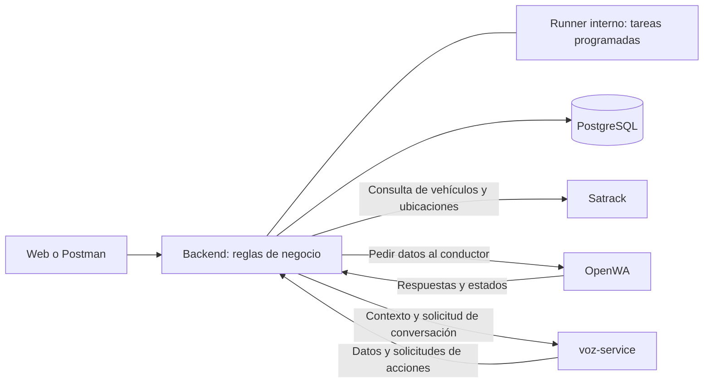

# Rumboo — Plan maestro del MVP

**Fuente de verdad del proyecto · Versión 1 · 6 de octubre de 2026**

**Estado: arquitectura aplicada al núcleo: DTO, composición por instancia, estado satelital separado y runner con trabajo persistido (§3). Funcionalidades restantes por hito.** El microservicio Satrack queda fuera de los cambios: se integra mediante su contrato HTTP existente. El código existente es trabajo en curso y no acredita que un épico esté terminado.

## 1. Objetivo, alcance y autoridad

> **Ayudamos a tu equipo de tráfico a recuperar, revisar y cerrar los cumplidos con menos trabajo manual, integrándonos con sus herramientas actuales.**

El MVP completo conecta registro de viajes, seguimiento con Satrack, comunicación con el conductor, recuperación del cumplido y cierre asistido. El primer entregable de monitoreo es una parte del MVP; por sí solo no valida la promesa de recuperar y cerrar cumplidos.

**Decisiones de alcance:** scraper Selenium de Satrack; WhatsApp mediante OpenWA; login con usuario y contraseña; aprobación humana antes de transmitir al RNDC. Las APIs oficiales de Satrack y WhatsApp quedan para después. Las llamadas del MVP son al conductor; los agentes que contactan al cliente y resuelven problemas cuando tú no estás pertenecen a una evolución futura.

**Primera entrega con seguimiento automático:** el runner del backend programa consultas, sigue jobs y recupera trabajo pendiente. Recordatorios y reportes se incorporan al implementar sus hitos; también se conservan acciones manuales y webhooks. Voz, extracción y RNDC siguen pendientes de sus proveedores y acceso.

Este documento gobierna backend, scraper, frontend e infraestructura. Cualquier cambio de alcance debe actualizar aquí el épico afectado, sus dependencias y su criterio de aceptación **antes de implementarlo**.

| Documento | Función y autoridad |
|---|---|
| Este `PLAN.md` | Alcance, épicos, arquitectura, contratos principales, orden y criterios de entrega vigentes |
| [ARQUITECTURA_BACKEND.md](../docs/ARQUITECTURA_BACKEND.md) | Detalle de fronteras, propiedad de datos, contratos públicos y recuperación del backend; complementa este plan |
| [TESIS.md](../TESIS.md) y [IDEA.md](../IDEA.md) | Contexto de negocio y visión; no amplían automáticamente el alcance técnico |
| [IMPLEMENTACION.md](../IMPLEMENTACION.md), [plan del scraper](../satrack-service/PLAN.md), [plan web](../docs/PLAN_WEB_PRODUCTO.md) y [plan previo general](../PLAN_IMPLEMENTACION.md) | Referencias subordinadas; sus discrepancias se resuelven a favor de este plan |
| [REFERENCIA_PLAN_ANTERIOR.md](REFERENCIA_PLAN_ANTERIOR.md) | Archivo histórico, especialmente del diseño de voz; no agrega requisitos al MVP |

**Fuera del MVP:** agentes autónomos de atención al cliente, correo, app para conductores, pagos/facturación, otros satelitales, OAuth, roles complejos, JWT y refresh tokens. Tampoco se construirá un framework genérico de agentes o un catálogo de herramientas editable en producción.

## 2. Lista completa de épicos

Esta lista constituye el alcance completo. Un épico termina cuando cumple su criterio y las pruebas de la sección 9; una pantalla o clase aislada no bastan.

| EP | Descripción y alcance | Por qué se incluye | Criterio de aceptación |
|---|---|---|---|
| **EP-01 · Plataforma y operación** | Docker Compose, configuración, PostgreSQL, migraciones, volúmenes, healthchecks, bootstrap y manual de arranque/puertos | Instalar y operar el producto de forma reproducible | Un entorno limpio arranca; migraciones repetibles; datos persistentes tras reinicio; respaldo y restauración documentados |
| **EP-02 · Acceso y aislamiento** | Login/logout, sesiones simples, usuarios por CLI y acceso limitado a su transportadora | Proteger información sin complicar la autenticación | Sesiones revocables y con vencimiento; ningún endpoint permite leer/modificar otra transportadora |
| **EP-03 · Registro de la operación** | Conductores, vehículos, viajes y remesas; consentimiento; formulario y plantilla Excel; ruta y puntos autorizados opcionales | Obtener los datos para seguir el viaje y asociar el cumplido | Manifiesto único; peso calculado; catálogos reutilizados; conflictos activos rechazados; importación devuelve creados/errores sin duplicados |
| **EP-04 · Microservicio del scraper** | Crawler convertido en API independiente; proveedores real/simulado; sesiones reutilizables, concurrencia acotada, errores y callback firmado; consulta de resultados y colección Postman para operación independiente | Reutilizar el acceso a Satrack y aislar Selenium del backend | Jobs `vehicles`/`positions` funcionan y devuelven datos disponibles de la ficha; resultados consultables con API key; colección Postman ejecutable sin backend; timeout libera navegador; duplicados/cola llena tienen respuesta definida; sin credenciales expuestas |
| **EP-05 · Cuenta satelital y consultas** | Credenciales cifradas por transportadora; sincronización de toda la flota con datos disponibles; consultas periódicas y manuales, callbacks idempotentes y reconciliación mediante el GET existente del scraper; consulta de resultados persistidos en backend | Automatizar el seguimiento sin consultas duplicadas o bloqueadas, incluyendo el scraper independiente sin callback | Una consulta pendiente por cuenta; flota y resultados persistentes; verificación programa viajes; resultados antiguos no alteran configuraciones nuevas; GET recupera trabajos sin callback; timeout permite una consulta posterior y cada fallo se cuenta una vez |
| **EP-06 · Posiciones e historial** | Última ubicación por vehículo, recorrido por viaje y horas GPS/captura separadas | Aportar contexto y una base verificable para las reglas | Sin coordenadas, velocidad o frescura inventadas; puntos repetidos no duplican historial; datos antiguos no reemplazan los recientes |
| **EP-07 · Reglas y alertas** | Desvío, detención, retraso, pérdida de señal y llegada; severidad, atención, cierre y deduplicación | Convertir el seguimiento en una acción útil | Reglas probadas con casos reproducibles; datos faltantes → no evaluable; alerta única por viaje/tipo; atención/cierre auditados |
| **EP-08 · WhatsApp con OpenWA** | Número dedicado; envío/recepción de texto, audio y fotos; asociación a viaje; autorización y estado de sesión | Obtener novedades y recuperar documentos por el canal inicial elegido | Entradas deduplicadas; archivos privados; mensajes sin viaje visibles; desconexión visible; reintentos sin envíos duplicados |
| **EP-09 · Voz al conductor** | `voz-service` para agentes de audio y llamadas solicitadas; transcripción, clasificación y herramientas para consultar, registrar novedades, actualizar ETA o solicitar seguimiento | Obtener información que el satelital no entrega y reducir llamadas manuales | Respeta autorización/horarios/límites; política de no respuesta; acciones validadas/auditadas; agente sin aprobación documental ni transmisión RNDC |
| **EP-10 · Reportes operativos** | Resumen consolidado por transportadora, avisos inmediatos y confirmación de cierre por bandeja/WhatsApp | Informar al equipo sin revisar cada viaje | Resumen solo con viajes activos; ETA/novedades con fuente visible; reportes/notificaciones registrados y sin duplicados |
| **EP-11 · Recuperación y revisión de cumplidos** | Solicitud de fotos y recordatorios, asociación a remesa, extracción con visión pendiente, validaciones, excepciones y aprobación humana | Resolver el trabajo principal de la tesis: conseguir y revisar el soporte | Documento ilegible/incierto exige revisión; diferencias visibles; aprobación registra usuario/hora/versión; soporte para todas las remesas |
| **EP-12 · RNDC y cierre asistido** | Preparación, transmisión con acceso validado, reconciliación y alternativa de carga manual confirmada | Completar el recorrido hasta un cierre verificable | Solo transmite lo aprobado; resultado incierto se consulta antes de reenviar; carga manual con evidencia; cierre tras confirmar todas las remesas y notificar |
| **EP-13 · Indicadores de pendientes** | Pendientes documentales, antigüedad, días hábiles y métricas por transportadora | Priorizar trabajo y medir el valor | Cálculos trazables/probados; calendario explícito; indicador regulatorio solo tras validar definición y contrastar con RNDC del cliente |
| **EP-14 · Bandeja web responsive** | Login, panel, viajes, flota, conexión, alertas, mensajes sin viaje, cumplidos e indicadores | Dar al coordinador una operación completa desde computador/móvil | Flujos conectados al backend; carga/error/vacío y confirmaciones; diseño `liquida-design`; fechas de Colombia y controles accesibles |
| **EP-15 · Calidad y piloto** | Simuladores de integraciones, datos demo, pruebas y piloto en sombra seguido de operación asistida | Comprobar utilidad y estabilidad con evidencia | Flujos/fallos externos probados; integraciones reales verificadas aparte; límites documentados; línea base y ahorro/costo por viaje medidos |

No se incluye exceso de velocidad en esta versión. Las referencias `REG`, `FRE`, `MON`, `TEC`, `ALE`, `CON`, `WA`, `REP` y `CUM` de `IMPLEMENTACION.md` orientan el detalle, pero este plan prevalece. Los umbrales son parámetros de piloto, no garantías ni afirmaciones normativas.

## 3. Arquitectura del backend

**Prioridad del primer MVP: organizar cinco componentes con responsabilidades explícitas.** El backend contiene la API y un runner interno para tareas periódicas y acciones pendientes; también recibe peticiones y webhooks. Las reglas permanecen en los módulos de negocio. El detalle se encuentra en [ARQUITECTURA_BACKEND.md](../docs/ARQUITECTURA_BACKEND.md).

### 3.1 Servicios externos y núcleo

| Componente | Responsabilidad | Estado de la integración |
|---|---|---|
| **Satrack** | Traer la ubicación de diferentes vehículos: flota, placa, dirección, coordenadas y demás datos disponibles | Servicio existente; completar su consumo desde Rumboo sin modificarlo |
| **OpenWA** | Conectar WhatsApp para pedir y recibir datos del conductor | Proveedor elegido; cliente HTTP y recepción de webhooks pendientes |
| **`voz-service`** | Manejar los agentes de audio y las conversaciones con el conductor | Servicio definido en la arquitectura; implementación y proveedor pendientes |
| **PostgreSQL** | Base de datos de Rumboo: viajes, conductores, vehículos, consultas, posiciones, mensajes y soportes | Persistencia administrada por el backend |
| **Backend** | Reglas de negocio, autorización, validaciones, estados y coordinación mediante API y runner interno | Base modular existente; funcionalidades por completar |



El backend coordina los servicios. Satrack no conoce viajes ni reglas. OpenWA transporta mensajes; el backend decide qué pedir y cómo usar la respuesta. `voz-service` ejecuta los agentes de audio; el backend valida sus solicitudes y modifica el negocio. Solo el backend accede a las tablas de Rumboo. OpenWA administra su propia persistencia según el despliegue elegido, sin acceso directo desde Rumboo.

### 3.2 Módulos por dominio y reglas de ortogonalidad

Cada módulo contiene sus propios `models.py`, `schemas.py`, `servicio.py` y `router.py`. Las funciones implementan los casos de uso y las clases se reservan para adaptadores y estructuras de datos.

| Módulo | Responsabilidad |
|---|---|
| `acceso` | Usuarios, sesiones y transportadoras |
| `operacion` | Conductores, vehículos, viajes, remesas, consentimiento y transiciones |
| `satelital` | Cuenta, consultas, flota satelital, posiciones e historial |
| `mensajeria` | Cliente OpenWA, mensajes, sesión y asociación de respuestas |
| `voz` (pendiente) | Cliente de voz-service, contexto autorizado y validación de resultados |
| `documentos` | Archivos privados, cumplidos, versiones y revisión humana |
| `monitoreo` | Reglas, puntos de control, alertas, novedades y rutas |
| `indicadores` | Panel, pendientes y reportes |
| `auditoria` | Registro de acciones y decisiones |
| `core` | Configuración, seguridad, conexiones, errores, paginación y runner de tareas |

1. **Cada módulo modifica únicamente sus tablas.** Otro módulo utiliza sus operaciones públicas y datos validados, sin importar sus modelos ni recibir entidades ORM mutables.
2. **Las dependencias no tienen ciclos.** Monitoreo consume operación y satelital; documentos y mensajería consumen operación; indicadores consulta servicios de lectura. Los módulos hermanos se conectan mediante operaciones compuestas explícitas.
3. **La composición enlaza las operaciones por instancia.** Para devolver un vehículo con su ubicación, combina DTO de operación y satelital por lotes, sin registros globales de extensiones. Las reacciones necesarias para el negocio guardan sus entregas junto al cambio que las origina; el runner invoca los consumidores registrados y deduplica efectos.
4. **Cada sistema externo tiene un adaptador:** `satelital/cliente.py`, `mensajeria/openwa.py`, el futuro `voz/cliente.py` y `documentos/almacenamiento.py`.
5. **El negocio no depende de HTTP.** Los servicios utilizan errores de dominio y los routers los traducen a respuestas HTTP. `voz-service` utiliza la API del backend para solicitar acciones de negocio.
6. **Las fronteras se prueban.** Import-linter, pruebas de contratos, aislamiento por transportadora y casos de uso con clientes externos falsos.

**Fronteras aplicadas:** servicios públicos con DTO, composición por instancia en `app/consultas.py`, estado propio en `VehiculoSatelital` y eventos internos persistidos en `EntregaPendiente`. Runner con reconciliación, recuperación y control de liderazgo. La migración `847a65cf24dd` traslada la presencia/última posición existente. Los envíos OpenWA y acciones de voz siguen pendientes de sus hitos y contratos.

### 3.3 Stack y decisiones

| Pieza | Elección | Motivo y límite |
|---|---|---|
| API | Python 3.12, FastAPI y Pydantic | Contratos validados, OpenAPI y REST |
| Datos | PostgreSQL 16, SQLAlchemy 2, psycopg 3 y Alembic | Transacciones, restricciones e índices |
| Geometría | shapely y haversine, sin PostGIS | GeoJSON y puntos manuales; corredores medidos en coordenadas métricas |
| Ejecución | API, runner interno y respuestas/webhooks | Consultas periódicas, seguimiento de jobs y acciones persistidas, con ejecución manual disponible |
| Integraciones | httpx y un adaptador por servicio | Firmas, formatos, timeouts e idempotencia aislados |
| Sesión y secretos | bcrypt, token opaco y Fernet | Login revocable y credenciales fuera de respuestas y logs |
| Archivos | Volumen privado y metadatos en PostgreSQL | Almacenamiento separado mediante un adaptador |
| Importación | openpyxl en modo solo lectura | Plantilla Excel de EP-03; sin evaluar fórmulas ni macros; tamaño, entradas del zip y filas acotados |
| Arquitectura | import-linter y pruebas de contrato | Fronteras verificables |
| Web | React, TypeScript, Vite, Tailwind, React Router, TanStack Query y Leaflet | SPA con liquida-design y API del backend |

### 3.4 Organización de servicios y repositorio

- `backend/`: API, reglas de negocio, runner interno y clientes de Satrack, OpenWA y voz-service.
- `satrack-service/`: servicio existente de ubicaciones; conserva código, endpoints, configuración y despliegue.
- OpenWA: servicio de terceros; responsabilidades y requisitos de imagen/revisión y sesión documentados en `infra/openwa/`, sin copiar ni envolver su código.
- PostgreSQL: imagen y volumen de datos; responsabilidades de configuración y respaldo documentadas en `infra/postgres/`.
- `voz-service/`: agentes de audio y adaptadores de voz/IA; directorio creado con su frontera; servicio ejecutable pendiente.
- `docs/`: arquitectura y contratos. Compose registra los servicios activos; voz se incorpora cuando esté implementada.

El árbol aplicado está en [ARQUITECTURA_BACKEND.md](../docs/ARQUITECTURA_BACKEND.md). Las carpetas de servicios pendientes contienen documentación; todavía no habilitan conexiones.

### 3.5 Runner, persistencia y recuperación

El runner vive en `core/tareas.py`, dentro del mismo proceso de la API. La composición registra funciones de los módulos; el ejecutor no importa reglas de negocio ni depende de FastAPI. Cada tarea utiliza su propia sesión de BD y los fallos de una integración no detienen las demás.

- **Programación satelital:** revisar cuentas cada 60 s y consultar viajes elegibles cada 5–10 min, con una consulta pendiente por cuenta.
- **Reconciliación:** revisar jobs pendientes cada 5 s mediante el GET existente; callback y GET aplican el mismo resultado idempotente. Un POST ambiguo se reconcilia y un UUID perdido se reenvía solo mientras siga vigente, con límites de intentos y plazo.
- **Evaluación temporal:** cada 60 s para reglas que dependen del tiempo y al aplicar posiciones. Falla del proveedor no equivale a pérdida de señal del vehículo.
- **Acciones externas:** enviar avisos, solicitudes y recordatorios desde una entrega persistida. El cambio y la intención se guardan juntos; la llamada HTTP ocurre fuera de bloqueos de negocio.
- **Recuperación:** al reiniciar, retomar consultas y acciones desde PostgreSQL, recuperar reclamaciones vencidas y deduplicar efectos. No depende de que el usuario abra la Web.

El ejecutor mantiene y comprueba un advisory lock en una conexión dedicada; si pierde esa conexión, detiene nuevas reclamaciones hasta recuperar liderazgo. Las reclamaciones de acciones tienen vencimiento y los reintentos conservan su clave de idempotencia. Ante un envío incierto se consulta el estado o se solicita revisión antes de reenviar.

`/health` muestra último intento, último éxito y error por tarea. El runner limita la concurrencia y no comparte sesiones de BD entre tareas. No se promete entrega exactamente una vez. PostgreSQL es suficiente para el trabajo pendiente del MVP, sin Redis, Celery ni otro servicio desplegable. Separar un worker después reutiliza los casos de uso, pero exige ajustar composición, configuración y salud compartida.

### 3.6 voz-service y agentes de audio

`voz-service` es el responsable de los agentes de audio: sesión conversacional, prompts, interpretación de respuestas y adaptadores del proveedor de voz/IA. Su proveedor, contratos e implementación siguen pendientes.

El backend valida contacto y autorización, entrega contexto limitado de conductor/viaje y conserva el estado de negocio. Cuando el agente solicita registrar una novedad, actualizar una ETA o pedir seguimiento, llama a la API autenticada del backend; el backend valida y audita la acción. No hay acceso directo de voz-service a PostgreSQL de Rumboo ni aprobaciones documentales automáticas.

La primera conversación se inicia por una acción explícita. Las llamadas programadas quedan para otra iteración. Extracción documental y clasificación automática de WhatsApp conservan su estado pendiente; no se agrega un framework de agentes.

### 3.7 Cómo agregar piezas

Un nuevo módulo declara responsabilidad, tablas y operaciones públicas; registra sus metadatos y router en la composición, agrega migración cuando corresponda y pruebas por módulo. Una integración externa agrega un adaptador, contratos validados y un cliente falso para las pruebas.

Las operaciones que combinan módulos se enlazan explícitamente y conservan la propiedad de sus datos. Los cambios de voz permanecen en voz-service mientras respeten su contrato; las reglas y permisos permanecen en el backend.

## 4. Datos, seguridad e invariantes

### 4.1 Modelo de datos

| Grupo (módulo dueño) | Entidades/datos esenciales | Restricciones |
|---|---|---|
| Acceso (`acceso`) | `transportadoras`, `usuarios`, `sesiones` | Usuario único; SHA-256 del token; transportadora obtenida de sesión |
| Operación (`operacion`) | `conductores`, `vehiculos`, `viajes`, `remesas` | Cédula/placa únicas por transportadora; manifiesto único por transportadora; remesa única por viaje; pesos positivos |
| Satelital (`satelital`) | `cuentas_satelitales`, `consultas_satelitales`, `posiciones`, `vehiculos_satelitales` | Una cuenta Satrack por transportadora; versión de credenciales; una consulta pendiente por cuenta; UUID único; punto único por vehículo/hora GPS conocida |
| Monitoreo (`monitoreo`) | `puntos_control`, `alertas`, `novedades`; `rutas_viaje` (GeoJSON) en M4 | Una alerta abierta por viaje/tipo; atención auditada; ruta/coordenadas opcionales |
| Comunicación (`mensajeria`) | `canales_whatsapp`, `mensajes` | ID externo/idempotencia únicos |
| Entregas internas (`core`) | `entregas_pendientes` técnicas (`core/models.py`, consumidas por `core/eventos.py`) | Consumidor estable, clave de deduplicación, estado, intentos, próxima ejecución y vencimiento de reclamación |
| Documentos (`documentos`) | `archivos_privados`, `cumplidos`, `versiones_cumplido` (+ archivos) | Soporte versionado; aprobación ligada a versión; cambios invalidan aprobación pendiente |
| Reportes (`indicadores`) | `reportes` (M4) | Período, viajes incluidos y estado de envío |
| Agentes de audio (`voz-service`, pendiente) | Sesiones conversacionales y contexto de ejecución | Solicita acciones mediante API; el backend registra y audita efectos de negocio |
| Voz y RNDC (módulos futuros, pendientes) | `llamadas`, `transmisiones_rndc` | Dueños separados de sus datos; sin implementar hasta definir proveedores y acceso RNDC |
| Trazabilidad | `eventos` | Solo inserción desde aplicación; actor/entidad/motivo/fecha; sin edición/borrado por API |

Entidades de negocio con `transportadora_id`; relaciones y accesos dentro de esa empresa. Webhooks resuelven la transportadora desde el canal/cuenta autenticado, no desde un ID libre del payload. Fechas UTC, presentación `America/Bogota`. Aislamiento y carreras se prueban sobre PostgreSQL.

### 4.2 Autenticación mínima y secretos

Usuarios por CLI; login con bcrypt; token aleatorio de 32 bytes, hash SHA-256 en BD y vencimiento de siete días. Navegador usa `sessionStorage` y Bearer; `401` limpia sesión/caché; logout revoca la fila. Sin registro público, roles, OAuth, JWT ni refresh tokens. Intentos de login limitados y error genérico.

Secretos por variables de entorno, fuera de Git/logs/respuestas. Satrack cifrado con Fernet usando `ENCRYPTION_KEYS` (rotable con `python -m app.cli recifrar`, independiente de `SECRET_KEY`); respaldar las claves junto con la BD. Archivos privados con límites de tamaño/tipo, nombres generados y acceso autorizado o enlaces firmados breves.

### 4.3 Invariantes de negocio

- Placa `AAA999`; cédula de 6–10 dígitos; celular colombiano `+57`; origen distinto de destino; llegada posterior a salida; al menos una remesa; peso total calculado en servidor. Excel agrupa filas por manifiesto y valida el viaje completo antes de crearlo; un grupo inválido no genera un viaje parcial. La importación reutiliza conductores y vehículos existentes sin modificarlos ni cambiar su consentimiento (si el celular no coincide, rechaza ese manifiesto) y los conductores nuevos quedan sin autorización; las fechas sin zona se interpretan en `America/Bogota` y un número no se acepta como fecha.
- `registrado`, `programado`, `en_ruta`, `con_novedad` reservan conductor/vehículo. Restricciones de BD impiden reservas simultáneas, incluidas pendientes de verificación. Entregar/cancelar libera la reserva aunque el cierre documental siga pendiente.
- Sin Satrack se puede guardar el viaje `registrado`; `programado` requiere placa confirmada con la configuración vigente.
- Hora GPS nullable: **nunca se sustituye por captura**. Coordenadas ausentes/`0,0`, velocidad desconocida y fechas ilegibles significan dato no disponible, no señal GPS reciente.
- Sin ruta no hay desvío/avance; sin coordenadas no hay geocerca; sin velocidad/estimación fiable no hay detención/ETA. La UI muestra qué no se puede evaluar, sin inventar normalidad o anomalías.
- Falla del scraper no genera «sin señal del vehículo». Las reglas usan muestras GPS distintas; repetir la misma hora no cuenta como dos lecturas consecutivas.
- Autorización registrada con fecha/canal antes de llamadas/mensajes automáticos; ausencia o revocación bloquea contactos y señala el viaje.
- IA interpreta; código valida herramientas/reglas; humano aprueba lo transmitido al RNDC. El contexto de viaje/transportadora se inyecta por servidor, nunca lo elige libremente el agente.

### 4.4 Ciclo de vida

```text
Operación:   registrado → programado → en_ruta ↔ con_novedad → entregado
             registrado / programado / en_ruta / con_novedad → cancelado
Documentos:  pendiente → en_revision → aprobado o rechazado (por versión y remesa)
RNDC:        pendiente de integración; su confirmación es un estado separado
```

`operacion` es dueño del estado operativo; `documentos`, del documental. El resumen del viaje combina esos estados sin permitir escrituras ajenas. Se conserva el campo HTTP `estado` operativo durante la reorganización; los estados adicionales se incorporan al implementar su hito.

Verificar placa programa; inicio y entrega se confirman manualmente. Detectar llegada por geocerca crea evidencia y aviso, no pasa el viaje a `entregado`. Alerta media/alta abre `con_novedad` mediante la operación pública; cerradas todas, vuelve a `en_ruta`. Cancelar exige motivo. Transiciones registran usuario/motivo o regla/job. Aprobar el soporte no confirma RNDC; el cierre definitivo sigue pendiente hasta confirmar todas las remesas y notificar.

## 5. Contratos principales

### 5.1 API del backend

Rutas `/api` con sesión salvo login. Callback satelital privado; webhooks externos de voz/WhatsApp solo al implementar su épico y con firma/autenticación del adaptador. La tabla describe el contrato objetivo: voz y RNDC siguen pendientes y no se publican endpoints simulados para esas capacidades.

| Contrato | Responsabilidad |
|---|---|
| POST `/api/auth/login`; GET `/api/auth/me`; POST `/api/auth/logout` | Acceso, usuario y revocación |
| GET `/api/panel`, `/api/indicadores` | Operación, conexión, pendientes y métricas |
| GET/POST `/api/viajes`; POST `/api/viajes/importar`; GET `/api/viajes/plantilla` | Lista/filtros/paginación, alta con remesas, importación atómica por manifiesto y plantilla Excel |
| GET `/api/viajes/{id}`; POST `/api/viajes/{id}/transiciones` | Detalle y cambio válido |
| GET `/api/viajes/{id}/posiciones`; PUT `/api/viajes/{id}/ruta` | Historial acotado y ruta/puntos de control |
| GET `/api/vehiculos`, `/api/conductores` | Catálogos paginados (`items`, `total`, `page`, `page_size`) y última posición |
| GET `/api/configuracion` | Parámetros vigentes de la transportadora, solo lectura |
| GET/PUT `/api/cuenta-satelital`; POST `/api/cuenta-satelital/sincronizar`, `/api/cuenta-satelital/consultar`; GET `/api/consultas-satelitales/{job_id}` | Credenciales/estado, verificación de placas, consulta manual y resultado persistido |
| GET `/api/alertas`; POST `/api/alertas/{id}/atender`, `/api/alertas/{id}/cerrar` | Lista, comentario/atención y resolución justificada |
| GET/POST `/api/viajes/{id}/mensajes`, `/api/viajes/{id}/llamadas` | Historial/contacto manual autorizado |
| GET `/api/mensajes/sin-viaje`; POST `/api/mensajes/{id}/asociar` | Revisión/asociación de entradas dentro de la empresa |
| GET/POST `/api/viajes/{id}/cumplidos` | Documentos y carga manual de soporte |
| POST `/api/cumplidos/{id}/aprobar`, `/api/cumplidos/{id}/rechazar` | Revisión humana de una versión específica |
| POST `/api/cumplidos/{id}/transmitir`, `/api/cumplidos/{id}/confirmar-carga-manual` | RNDC aprobado o evidencia de carga manual |
| POST `/internal/satrack/callback`, `/internal/whatsapp/eventos`, `/internal/voz/{proveedor}/estado` | Eventos autenticados/deduplicados |
| GET `/health` | Disponibilidad API/BD sin secretos |

Alta de viaje: manifiesto, origen/destino, fechas con zona horaria, conductor, vehículo y remesas. Sin CRUD genérico de tablas. Errores: `401` sesión/firma, `404` recurso inaccesible, `409` conflicto, `422` validación con campo/mensaje, `503` indisponibilidad temporal y `500` genérico sin datos sensibles.

### 5.2 Scraper y resultados

`POST /v1/jobs`, con `X-Api-Key`: UUID `job_id`, `type` (`vehicles`/`positions`), `account` (`id`, `username`, `password`) y `plates`. `202` aceptado, `409` UUID repetido, `503` cola llena. `GET /health`: proveedor/trabajos/sesiones. Callback URL fijo por configuración, nunca por request.

`GET /v1/jobs/{job_id}`, también con `X-Api-Key`, permite consultar estado (`queued`/`running`/`done`), entrega del callback y resultado sin devolver credenciales. Resultados en memoria durante una hora, con límite de retención configurable; reiniciar elimina ese historial. `CALLBACK_URL` vacío permite usar el scraper de forma independiente. La colección Postman crea jobs y consulta sus resultados; credenciales solo en variables locales. Un job `vehicles` incluye ubicación, velocidad, estado y hora GPS cuando la ficha de Satrack los expone; campos ausentes permanecen `null`.

Callback: `job_id`, `type`, `status` (`ok`/`partial`/`failed`), `finished_at`, `positions`, `vehicles`, `errors`. Posición: placa, coordenadas/velocidad/hora GPS nullable, dirección, estado y texto original de fecha. HMAC-SHA256 del body exacto en `X-Signature`; `X-Job-Id` debe coincidir.

1. Backend reserva y confirma consulta en BD **antes** de enviar HTTP, fuera de la transacción; scraper acepta/ejecuta en segundo plano.
2. Una consulta pendiente por cuenta. El runner revisa cuentas cada 60 s y consulta cada 5–10 min según configuración; monitorea viajes en ruta/con novedad y programados desde una hora antes de salida. El usuario también puede sincronizar la flota o consultar ubicaciones. Sin placas elegibles no se pide ubicación; verificar flota es un job aparte.
3. Scraper: tres jobs/sesiones, cola de 50, inactividad 15 min y timeout 120 s incluyendo espera. Selenium en proceso cancelable por cuenta: cancelar un hilo no garantiza parar el navegador.
4. Callback: cuatro intentos con pausas 2/10/30 s. Backend valida firma/UUID/tipo/versión de cuenta, bloquea consulta y confirma datos/eventos en una transacción. Duplicado aplicado → `200` sin repetir efectos.
5. Tras 240 s sin resultado, contados desde el primer POST, el runner aplica timeout y cuenta el fallo una sola vez. Antes de vencer una consulta pregunta al scraper: si el resultado está listo, lo aplica aunque la API haya estado detenida. Un resultado tardío de una consulta ya vencida o cancelada se guarda y aporta historial, sin cambiar el estado de la consulta ni de la cuenta ni reemplazar la última posición. Cambiar credenciales invalida resultados anteriores.
6. El runner reconcilia consultas pendientes con `GET /v1/jobs/{job_id}` cada cinco segundos, sin depender de la Web o Postman. Un resultado terminado pasa por el mismo procesamiento idempotente del callback; si el scraper no conoce el UUID, se reenvía el mismo job mientras esté pendiente y su configuración siga vigente. Esto permite usar el servicio independiente con callback desactivado, sin cambiarlo. Los resultados completos validados se guardan en PostgreSQL, sin credenciales, y se consultan con sesión y aislamiento por transportadora.
7. Sincronizar `vehicles` incorpora todas las placas válidas de la cuenta, conserva alias/identificador y guarda sus datos satelitales disponibles. Una respuesta parcial no marca como ausentes vehículos que no incluye. El historial y la última posición se actualizan con las mismas reglas que `positions`.

Errores: `AUTH_FAILED`, `CAPTCHA_REQUIRED`, `PROVIDER_CHANGED`, `PROVIDER_UNAVAILABLE`, `TIMEOUT`, `VEHICLE_NOT_FOUND`, `POSITION_UNAVAILABLE`. Auth inválida detiene consulta; captcha/cambio aplica 15 min de backoff; tres fallos marcan conexión degradada. El mismo fallo se cuenta una vez aunque coincidan timeout local y callback tardío.

### 5.3 Efectos externos y voz

Las acciones externas se registran en PostgreSQL junto al cambio que las origina, con clave de idempotencia, estado, intentos y próxima ejecución. El runner reclama cada entrega con bloqueo breve y vencimiento, hace HTTP fuera de la transacción y registra aceptación o error. Tras un reinicio recupera las pendientes. Cada intento vuelve a validar consentimiento y configuración vigentes. Envío ambiguo exige reconciliar o revisar; una clave de deduplicación vencida no autoriza un reenvío automático. La aceptación del proveedor y la entrega al destinatario son estados distintos.

Voz: agentes de audio y adaptadores en `voz-service`; contexto autorizado y acciones validadas/auditadas por la API del backend. Sin agentes anidados, suspensiones genéricas, múltiples LLM activos ni catálogo dinámico. El diseño histórico conserva esas posibilidades futuras.

## 6. Parámetros iniciales del piloto

Umbrales y frecuencias configurables por transportadora. Se activan mediante el runner al implementar cada hito y validar consentimiento. Los parámetros de voz y RNDC siguen pendientes hasta disponer de sus integraciones; también se conservan acciones manuales.

| Área | Valores iniciales |
|---|---|
| Ubicación/reglas | Consulta 5 min; corredor 5 km; llegada 1 km; dos muestras distintas; detención <5 km/h durante 60 min; señal sin actualizar 30 min; margen de retraso 60 min |
| Contacto | Llamada cada 60 min; omitir con contacto hace <30 min; máximo 2 min/3 preguntas; dos intentos separados 10 min; descanso 22:00–05:00 en parada autorizada |
| WhatsApp/reportes | Un mensaje automático cada 15 min salvo cierre documental; resumen cada 3 h; avisos graves inmediatos; re-notificación alta cada 30 min |
| Cumplidos | Recordatorio cada 2 h; escalamiento a 6/24 h; tolerancia de peso propuesta 0,5 %; documento coincidente, firma/sello, fecha válida y observaciones revisadas |
| RNDC/indicadores | Hasta tres intentos de fallos inequívocos; reconciliar resultados inciertos; calendario colombiano; ventanas/umbrales oficiales por validar |

ETA solo con ruta/muestras suficientes y etiquetada como estimación. ETA del conductor separada de llegada pactada; velocidad de referencia nunca presentada como medición GPS.

## 7. Contenedores y configuración

| Servicio | Contenido | Puerto interno | Acceso local previsto | Persistencia |
|---|---|---|---|---|
| `web` | React + nginx + proxy `/api` | 80 | `localhost:8080` | Build reproducible |
| `api` | FastAPI, reglas de negocio, runner interno, clientes externos y Alembic | 8000 | `localhost:8000` diagnóstico | BD + documentos privados |
| `satrack` | FastAPI, Selenium, Chromium, sesiones en procesos | 8080 | `localhost:8081` diagnóstico | Evidencias; sesiones/jobs volátiles |
| `db` | PostgreSQL 16, sin PostGIS en el MVP | 5432 | Sin puerto público | `pg_data` |
| `openwa` | Repositorio OpenWA elegido + sesión del número dedicado | Por verificar en EP-08 | Sin exposición pública por defecto | Sesión/credenciales |
| `voz` (pendiente) | Agentes de audio en voz-service | Por definir | Acceso autenticado desde el backend | Por definir con proveedor |

Diagnóstico enlazado solo a loopback; PostgreSQL/callback satelital en red privada. Puerto, autenticación y eventos de OpenWA se comprueban contra la revisión elegida antes del adaptador. Para piloto externo: HTTPS y únicamente webhooks necesarios.

Configuración base: `DATABASE_URL`, `SECRET_KEY`, `ENCRYPTION_KEYS`, `SATRACK_SERVICE_URL`, `SATRACK_SERVICE_API_KEY`, `CALLBACK_SECRET`, `PROVIDER`, límites del scraper, `SCHEDULER_ENABLED`, `SCHEDULER_INTERVAL_S`, `CONSULTA_TIMEOUT_S`, `SESSION_DAYS` y directorios privados. Los épicos de integración agregan solo configuración de proveedores activos; `.env.example` sin secretos reales.

EP-01 entregará `DOCKER.md` con comandos, puertos definitivos, contenido/volúmenes, bootstrap, demo, logs y respaldo/restauración; manual operativo subordinado a este plan.

## 8. Orden y dependencias

| Entrega | Épicos/dependencias | Resultado verificable |
|---|---|---|
| **A · Núcleo operativo** | EP-01–06; parte de EP-14/15 para login, viajes, flota, ajustes y demo | Login → Satrack → crear/verificar viaje → iniciar → consultar/mapear → entregar/cancelar |
| **B · Seguimiento asistido** | EP-07 sobre EP-06/ruta/datos; EP-08 sobre EP-02/03; EP-09 sobre EP-07/08; EP-10 sobre alertas/contactos; ampliar EP-14/15 | Regla → alerta → contacto → novedad → reporte, con trazabilidad |
| **C · Cumplido y piloto completo** | EP-11 sobre EP-03/08; EP-12 sobre EP-11/acceso RNDC; EP-13 sobre documentos/transmisiones; completar EP-14/15 | Pedir soporte → revisar/aprobar → RNDC o carga manual confirmada → cerrar → medir |

Validar acceso Satrack/campos GPS y acceso RNDC desde A para detectar bloqueos temprano. Simuladores permiten desarrollar, pero no acreditan integración real. Carga manual RNDC es una alternativa del MVP; si es la única disponible, el piloto se presenta como cierre asistido con carga manual.

### 8.1 Plan de ejecución del backend por hitos

**Alcance:** completar el backend por módulos, en hitos que se puedan verificar. Cada hito termina con un recorrido completo, pruebas en verde y contratos de arquitectura cumplidos. El microservicio Satrack se conserva sin cambios: código, endpoints, configuración y despliegue. El frontend operativo es una entrega aparte. Ningún paso pendiente se presenta como implementado.

| Hito | Módulos | Trabajo | Resultado verificable |
|---|---|---|---|
| **M0 · Separación** ✅ | `core`, `auditoria`, `acceso`, `operacion`, `satelital`, `indicadores`, y los paquetes documentados `documentos`, `mensajeria`, `monitoreo` y `voz` | Separación por dominio, DTO públicos, composición por instancia, errores de dominio, entregas internas persistidas y runner independiente de FastAPI. Migración del estado satelital, con conservación de ubicaciones; contrato HTTP de operación conservado | `uv run lint-imports` con 7 contratos cumplidos; `uv run pytest` en verde; `alembic check` sin diferencias |
| **M1 · Núcleo** ✅ | `satelital`, `operacion`, `acceso` (configuración), `core.tareas` | **Consultas persistentes:** la consulta se registra antes del POST; si el POST es ambiguo, no se marca `fallido` y decide la reconciliación; el runner reconcilia con `GET /v1/jobs/{id}` cada 5 s (callback y GET pasan por el mismo `apply_result` idempotente); un UUID desconocido se reenvía mientras siga vigente y con reintentos acotados; el timeout de 240 s cuenta el fallo una sola vez. **Persistencia y flota:** se guarda el resultado completo sin credenciales; la sincronización trae toda la flota sin marcar ausentes los vehículos de una respuesta parcial; `vehiculos_satelitales` resuelve la deuda de §3.2; nuevo `GET /api/consultas-satelitales/{job_id}`. **Operación y API:** importación Excel atómica por manifiesto; listados paginados; `GET /api/configuracion`; colección Postman | login → conectar Satrack → flota completa → registrar viaje → `programado` → ubicación → entregar, **con el callback desactivado, reiniciando la API a mitad de un job y verificando recuperación automática sin una petición de seguimiento** |
| **M2 · Cumplido manual** | `documentos`, `indicadores` | Archivos privados; cumplido por remesa con versiones; datos declarados por una persona con su procedencia; validaciones; aprobar o rechazar una versión concreta; `estado_documental` del viaje; pendientes por antigüedad en días hábiles (estimación) | Viaje entregado con 2 remesas → subir fotos → rechazar v1 → aprobar v2 → el pendiente desaparece |
| **M3 · WhatsApp y alertas** | `mensajeria` (primero un spike de OpenWA), `monitoreo` | Entregas persistidas para envíos y reintentos seguros mediante el runner; webhook firmado; bandeja sin viaje; solicitud de datos y recordatorios de cumplido; puntos de control; reglas de señal, detención, llegada detectada y llegada pactada vencida; atender y cerrar alertas | login → registrar viaje → alerta atendida → pedir soporte por WhatsApp → foto recibida → revisar y aprobar su versión → pendientes al día |
| **M4 · Rutas y reportes** | `monitoreo`, `indicadores` | Ruta en GeoJSON con shapely: desvío, avance y ETA; resumen periódico y avisos mediante el runner, además de solicitudes manuales | Desvío detectado y resumen enviado |
| Pendiente | `voz-service`, integración `voz` del backend y módulos futuros | Agentes de audio, extracción y RNDC cuando se definan proveedor y acceso (§3.6) | — |

**M1 terminado:** DTO, composición por instancia, flota completa con ubicaciones, resultado validado persistido, GET autenticado de consultas, catálogos paginados, `GET /api/configuracion`, importación Excel por manifiesto con plantilla y colección Postman por épico (con prueba de contrato contra las rutas). Runner con programación, reconciliación que consulta el GET antes de vencer, liderazgo y recuperación desde PostgreSQL; las reacciones internas se guardan junto al cambio. **Evidencia:** `scripts/verificar.sh` y `scripts/demo_m1.py`, que recorre login → Satrack → flota → viaje `programado` → ubicación → entregado con el callback desactivado y la API detenida a mitad de un job más tiempo que `CONSULTA_TIMEOUT_S`. **Límites conocidos:** aplicar un resultado de flota cuesta unas 11 sentencias por vehículo nuevo dentro de una transacción (medido; suficiente para flotas piloto); la integración con una cuenta Satrack real sigue sujeta a §10. M3 añade estados de envío OpenWA, recordatorios y reglas; no basta con reutilizar el consumidor transaccional de BD para hacer HTTP.

**Decisiones de modelo para los hitos:**

- **Sin tabla `EstadoMonitoreo`:** las reglas se recalculan desde las posiciones guardadas.
- **La revisión del cumplido va en `VersionCumplido`:** decisión, motivo, quién revisó y cuándo; hay una sola decisión por versión.
- **Sin tabla `DiaNoLaboral`:** se usan los festivos de Colombia con la librería `holidays`.
- **`Reporte` y `RutaViaje` llegan en M4.**
- **La llegada a la geocerca no pasa el viaje a `entregado`.**
- **Sin velocidad de referencia para la ETA.**

### 8.2 Integraciones posteriores del backend

Las decisiones pendientes de la sección 10 se resuelven antes de implementar cada adaptador afectado. La revisión humana de los soportes y la aprobación de la transmisión al RNDC siguen siendo parte del flujo de negocio. Ningún agente puede reemplazarlas (§3.6).

## 9. Calidad y criterios de entrega

- **Backend:** sesión/vencimiento/logout, aislamiento, validaciones/Excel, reservas concurrentes, estados/aprobaciones, tareas periódicas y migraciones sobre PostgreSQL.
- **Arquitectura:** `uv run lint-imports` sin contratos rotos; `tests/test_arquitectura.py` (fronteras + `alembic check`); servicios de negocio y runner probados sin FastAPI; liderazgo, reclamaciones vencidas y aislamiento de fallos; cada módulo con sus pruebas en `tests/<modulo>/`.
- **Integraciones:** firmas, duplicados, resultados tardíos/fuera de orden, credenciales cambiadas, navegador bloqueado, reinicio sin callback, OpenWA desconectado, llamada fallida y RNDC incierto.
- **Reglas/documentos:** datos incompletos/obsoletos/repetidos, sin ruta, desvío/llegada, deduplicación de alertas, foto ilegible, remesa incorrecta, diferencias de peso y aprobación invalidada por cambio del soporte.
- **Frontend:** build TypeScript, errores por campo, sesión vencida, remesas múltiples, flujo completo escritorio/móvil y acceso autorizado a documentos.
- **Operación:** arranque limpio, reinicio, respaldo/restauración con claves/archivos, healthchecks, recursos y secretos ausentes de logs/respuestas.
- **Piloto:** integración real y límites visibles; sombra → asistido; línea base de minutos manuales, demora documental/cierre, errores, uso y costo por viaje. Metas acordadas antes de iniciar y resultados medidos.

**Definition of Done:** criterio del épico cumplido, pruebas con evidencia, contratos/documentación actualizados y ningún error crítico abierto. MVP completo = EP-01–15 y recorrido C; A no se etiqueta como producto completo.

## 10. Decisiones pendientes

| Decisión | Capacidad afectada | Resolver antes de implementar |
|---|---|---|
| Acceso/campos Satrack | Scraper real/reglas GPS | Cuenta piloto: login/captcha/2FA, placas, coordenadas, hora y velocidad; registrar disponibilidad real |
| Ruta/puntos de control | Desvío/avance/geocercas | GeoJSON cargado + coordenadas de origen/destino/paradas, calculado con shapely (sin PostGIS); definir de dónde salen las coordenadas (pin manual o geocodificación) con el coordinador |
| Contrato OpenWA | Mensajes/fotos | Fijar repositorio/revisión, número, endpoints, autenticación, webhooks, puerto y sesión |
| Telefonía/voz/visión | Llamadas/extracción real | Un proveedor inicial por función; validar acceso, costos, formatos, firmas y latencia |
| RNDC/indicadores | Transmisión/indicador regulatorio | Verificar acceso, campos, confirmación/idempotencia y definiciones oficiales; mantener alternativa manual |
| Transportadora piloto | Utilidad | Acordar contactos/autorizaciones, parámetros, línea base y criterios de avance |

No bloquean planificación/demo; las capacidades afectadas no se consideran listas con datos inventados o pruebas exclusivamente simuladas.
