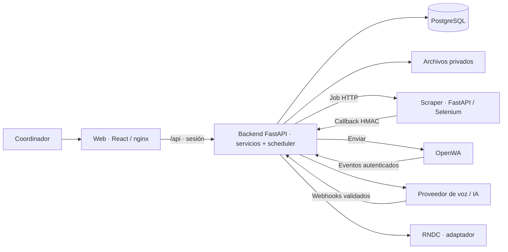

# Rumboo — Plan maestro del MVP

**Fuente de verdad del proyecto · Versión 1 · 6 de octubre de 2026**

**Estado: planificación.** El desarrollo queda detenido por solicitud del usuario. El código existente es trabajo en curso y no acredita que un épico esté terminado.

## 1. Objetivo, alcance y autoridad

> **Ayudamos a tu equipo de tráfico a recuperar, revisar y cerrar los cumplidos con menos trabajo manual, integrándonos con sus herramientas actuales.**

El MVP completo conecta registro de viajes, seguimiento con Satrack, comunicación con el conductor, recuperación del cumplido y cierre asistido. El primer entregable de monitoreo es una parte del MVP; por sí solo no valida la promesa de recuperar y cerrar cumplidos.

**Decisiones de alcance:** scraper Selenium de Satrack; WhatsApp mediante OpenWA; login con usuario y contraseña; aprobación humana antes de transmitir al RNDC. Las APIs oficiales de Satrack y WhatsApp quedan para después. Las llamadas del MVP son al conductor; los agentes que contactan al cliente y resuelven problemas cuando tú no estás pertenecen a una evolución futura.

Este documento gobierna backend, scraper, frontend e infraestructura. Cualquier cambio de alcance debe actualizar aquí el épico afectado, sus dependencias y su criterio de aceptación **antes de implementarlo**.

| Documento | Función y autoridad |
|---|---|
| Este `PLAN.md` | Alcance, épicos, arquitectura, contratos principales, orden y criterios de entrega vigentes |
| [TESIS.md](../TESIS.md) y [IDEA.md](../IDEA.md) | Contexto de negocio y visión; no amplían automáticamente el alcance técnico |
| [IMPLEMENTACION.md](../IMPLEMENTACION.md), [plan del scraper](../satrack-service/PLAN.md), [plan web](../web/PLAN.md) y [plan previo general](../PLAN_IMPLEMENTACION.md) | Referencias subordinadas; sus discrepancias se resuelven a favor de este plan |
| [REFERENCIA_PLAN_ANTERIOR.md](REFERENCIA_PLAN_ANTERIOR.md) | Archivo histórico, especialmente del diseño de voz; no agrega requisitos al MVP |

**Fuera del MVP:** agentes autónomos de atención al cliente, correo, app para conductores, pagos/facturación, otros satelitales, OAuth, roles complejos, JWT y refresh tokens. Tampoco se construirá un framework genérico de agentes o un catálogo de herramientas editable en producción.

## 2. Lista completa de épicos

Esta lista constituye el alcance completo. Un épico termina cuando cumple su criterio y las pruebas de la sección 9; una pantalla o clase aislada no bastan.

| EP | Descripción y alcance | Por qué se incluye | Criterio de aceptación |
|---|---|---|---|
| **EP-01 · Plataforma y operación** | Docker Compose, configuración, PostgreSQL, migraciones, volúmenes, healthchecks, bootstrap y manual de arranque/puertos | Instalar y operar el producto de forma reproducible | Un entorno limpio arranca; migraciones repetibles; datos persistentes tras reinicio; respaldo y restauración documentados |
| **EP-02 · Acceso y aislamiento** | Login/logout, sesiones simples, usuarios por CLI y acceso limitado a su transportadora | Proteger información sin complicar la autenticación | Sesiones revocables y con vencimiento; ningún endpoint permite leer/modificar otra transportadora |
| **EP-03 · Registro de la operación** | Conductores, vehículos, viajes y remesas; consentimiento; formulario y plantilla Excel; ruta y puntos autorizados opcionales | Obtener los datos para seguir el viaje y asociar el cumplido | Manifiesto único; peso calculado; catálogos reutilizados; conflictos activos rechazados; importación devuelve creados/errores sin duplicados |
| **EP-04 · Microservicio del scraper** | Crawler convertido en API independiente; proveedores real/simulado; sesiones reutilizables, concurrencia acotada, errores y callback firmado; consulta de resultados y colección Postman para operación independiente | Reutilizar el acceso a Satrack y aislar Selenium del backend | Jobs `vehicles`/`positions` funcionan y devuelven datos disponibles de la ficha; resultados consultables con API key; colección Postman ejecutable sin backend; timeout libera navegador; duplicados/cola llena tienen respuesta definida; sin credenciales expuestas |
| **EP-05 · Cuenta satelital y consultas** | Credenciales cifradas por transportadora; verificación de placas; scheduler, consulta manual, callbacks idempotentes y recuperación por timeout | Automatizar seguimiento sin consultas duplicadas o bloqueadas | Una consulta pendiente por cuenta; verificación programa viajes; resultados antiguos no alteran configuraciones nuevas; fallos técnicos distinguibles de pérdida de señal |
| **EP-06 · Posiciones e historial** | Última ubicación por vehículo, recorrido por viaje y horas GPS/captura separadas | Aportar contexto y una base verificable para las reglas | Sin coordenadas, velocidad o frescura inventadas; puntos repetidos no duplican historial; datos antiguos no reemplazan los recientes |
| **EP-07 · Reglas y alertas** | Desvío, detención, retraso, pérdida de señal y llegada; severidad, atención, cierre y deduplicación | Convertir el seguimiento en una acción útil | Reglas probadas con casos reproducibles; datos faltantes → no evaluable; alerta única por viaje/tipo; atención/cierre auditados |
| **EP-08 · WhatsApp con OpenWA** | Número dedicado; envío/recepción de texto, audio y fotos; asociación a viaje; autorización y estado de sesión | Obtener novedades y recuperar documentos por el canal inicial elegido | Entradas deduplicadas; archivos privados; mensajes sin viaje visibles; desconexión visible; reintentos sin envíos duplicados |
| **EP-09 · Voz al conductor** | Llamadas programadas, por alerta y manuales; transcripción, clasificación y herramientas para consultar, registrar novedades, actualizar ETA o solicitar seguimiento | Obtener información que el satelital no entrega y reducir llamadas manuales | Respeta autorización/horarios/límites; política de no respuesta; acciones validadas/auditadas; agente sin aprobación documental ni transmisión RNDC |
| **EP-10 · Reportes operativos** | Resumen consolidado por transportadora, avisos inmediatos y confirmación de cierre por bandeja/WhatsApp | Informar al equipo sin revisar cada viaje | Resumen solo con viajes activos; ETA/novedades con fuente visible; reportes/notificaciones registrados y sin duplicados |
| **EP-11 · Recuperación y revisión de cumplidos** | Solicitud de fotos, recordatorios, asociación a remesa, extracción con visión, validaciones, excepciones y aprobación humana | Resolver el trabajo principal de la tesis: conseguir y revisar el soporte | Documento ilegible/incierto exige revisión; diferencias visibles; aprobación registra usuario/hora/versión; soporte para todas las remesas |
| **EP-12 · RNDC y cierre asistido** | Preparación, transmisión con acceso validado, reconciliación y alternativa de carga manual confirmada | Completar el recorrido hasta un cierre verificable | Solo transmite lo aprobado; resultado incierto se consulta antes de reenviar; carga manual con evidencia; cierre tras confirmar todas las remesas y notificar |
| **EP-13 · Indicadores de pendientes** | Pendientes documentales, antigüedad, días hábiles y métricas por transportadora | Priorizar trabajo y medir el valor | Cálculos trazables/probados; calendario explícito; indicador regulatorio solo tras validar definición y contrastar con RNDC del cliente |
| **EP-14 · Bandeja web responsive** | Login, panel, viajes, flota, conexión, alertas, mensajes sin viaje, cumplidos e indicadores | Dar al coordinador una operación completa desde computador/móvil | Flujos conectados al backend; carga/error/vacío y confirmaciones; diseño `liquida-design`; fechas de Colombia y controles accesibles |
| **EP-15 · Calidad y piloto** | Simuladores de integraciones, datos demo, pruebas y piloto en sombra seguido de operación asistida | Comprobar utilidad y estabilidad con evidencia | Flujos/fallos externos probados; integraciones reales verificadas aparte; límites documentados; línea base y ahorro/costo por viaje medidos |

No se incluye exceso de velocidad en esta versión. Las referencias `REG`, `FRE`, `MON`, `TEC`, `ALE`, `CON`, `WA`, `REP` y `CUM` de `IMPLEMENTACION.md` orientan el detalle, pero este plan prevalece. Los umbrales son parámetros de piloto, no garantías ni afirmaciones normativas.

## 3. Arquitectura del backend

### 3.1 Topología y responsabilidades

**Monolito modular FastAPI + microservicio satelital + OpenWA + PostgreSQL**, en un servidor con Docker Compose. Voz, visión y RNDC se consumen mediante adaptadores; inicialmente no necesitan microservicios propios.



- **Backend:** propietario exclusivo de BD, reglas, transiciones, autorización y programación.
- **Scraper:** consulta Satrack; no conoce viajes/usuarios/reglas ni accede a PostgreSQL.
- **OpenWA:** administra sesión y transporte de WhatsApp; las decisiones de negocio quedan en backend.
- **Frontend:** presenta información y recoge acciones; no decide reglas críticas ni accede directamente a integraciones.

### 3.2 Capas, clases y dependencias

```text
routers (HTTP) → services (casos de uso y transacciones)
                          ├→ models / db (persistencia)
                          └→ integrations (satelital, WhatsApp, voz, visión, RNDC)
callbacks / scheduler ────→ services
```

Servicios concretos: `AuthService`, `ViajeService`, `CuentaSatelitalService`, `MonitoreoService`, `AlertaService`, `MensajeriaService`, `LlamadaService`, `CumplidoService` y `ReporteService`. Reciben dependencias explícitas; no comparten una sesión de BD entre peticiones.

Los proveedores usan interfaces pequeñas y clases concretas: `SatelliteClient → SatrackServiceClient`, `MessagingProvider → OpenWAProvider`, y equivalentes para telefonía, IA, RNDC y archivos. Intercambian modelos propios; un SDK externo se importa solo en su adaptador. La API oficial podrá añadirse sin cambiar viajes, reglas o pantallas.

**Composición sobre herencia generalizada:** clases para encapsular servicios/proveedores; una base común solo cuando exista comportamiento compartido real. Sin `BaseService` universal, repositorios genéricos o registros dinámicos para funcionalidades hipotéticas. Modelos/schemas empiezan agrupados y se dividen por dominio cuando crezcan.

### 3.3 Stack y decisiones

| Pieza | Elección | Motivo y límite |
|---|---|---|
| API | Python 3.12, FastAPI y Pydantic | Reutiliza el lenguaje del crawler; contratos validados, OpenAPI y REST |
| Datos | PostgreSQL 16, SQLAlchemy 2 síncrono, psycopg 3 y Alembic | Transacciones/restricciones/índices; acceso sencillo, fuera del event loop cuando bloquee |
| Geometría | PostGIS al implementar EP-07 | Corredores/geocercas reproducibles; el núcleo EP-01–06 no depende de geometría avanzada |
| Programación | Scheduler `asyncio` dentro de API al inicio | Un worker evita ciclos duplicados; consultas, reintentos y trabajo de negocio pendientes persisten en BD |
| Integraciones | httpx y adaptadores tipados | Timeouts, firmas, errores e idempotencia por integración |
| Sesión/secretos | bcrypt, token opaco y Fernet | Login revocable; contraseña de usuario hasheada; credenciales Satrack descifrables solo en backend |
| Archivos | Volumen privado + metadatos en BD | Suficiente para piloto; interfaz `FileStorage` permite migrar a almacenamiento de objetos |
| Web | React, TypeScript, Vite, Tailwind, React Router, TanStack Query y Leaflet | SPA, caché/refresco y mapas; tokens/componentes `liquida-design`; mismo origen `/api` |
| Instalación | `uv.lock`, `package-lock.json` y Docker Compose | Dependencias reproducibles y configuración separada del código |

PostgreSQL conserva entregas pendientes para mensajes/reportes/cierres. Un trabajador las reclama y reintenta según su estado; no se depende de memoria para efectos de negocio. **Sin Redis, Celery, Kubernetes ni broker genérico en el MVP.**

### 3.4 Estructura objetivo

```text
backend/
├── PLAN.md
├── app/
│   ├── main.py, config.py, db.py, deps.py, security.py
│   ├── models.py, schemas.py, validators.py
│   ├── routers/              # auth, viajes, flota, cuenta, panel,
│   │                         # alertas, mensajes, cumplidos, indicadores, internal
│   ├── services/             # casos de uso por dominio
│   ├── integrations/         # satelital, mensajeria, telefonia, ia, rndc, archivos
│   ├── callbacks/            # validación/despacho de eventos externos
│   ├── rules/                # reglas determinísticas y parámetros
│   ├── voice/                # conversación y herramientas acotadas
│   ├── scheduler.py, cli.py
├── alembic/versions/
├── tests/
└── pyproject.toml, uv.lock, Dockerfile, .env.example
```

Cada directorio se crea cuando lo necesita su épico. No se generan módulos vacíos para capacidades futuras. Scraper y web mantienen dependencias, pruebas y Dockerfile propios.

### 3.5 Crecimiento y límites

Una réplica de API y otra de scraper al inicio. PostgreSQL guarda el estado operativo; navegadores y deduplicación temporal del scraper son volátiles. Un reinicio puede perder jobs aceptados: backend recupera por timeout. No se promete entrega exactamente una vez.

Para crecer: separar scheduler/trabajador, reclamar pendientes con bloqueos en BD, replicar la API y enrutar cuentas a una réplica del scraper con afinidad. Cola durable y almacenamiento de objetos se incorporan cuando el volumen lo justifique, conservando contratos de servicios/proveedores.

Listas paginadas, historial acotado e índices por transportadora/viaje/fecha desde el inicio. La capacidad se fija tras medir latencia, RAM por navegador, crecimiento del historial y costo por viaje; no se presupone escala ilimitada.

## 4. Datos, seguridad e invariantes

### 4.1 Modelo de datos

| Grupo | Entidades/datos esenciales | Restricciones |
|---|---|---|
| Acceso | `transportadoras`, `usuarios`, `sesiones` | Usuario único; SHA-256 del token; transportadora obtenida de sesión |
| Operación | `conductores`, `vehiculos`, `viajes`, `remesas` | Cédula/placa únicas por transportadora; manifiesto único por transportadora; remesa única por viaje; pesos positivos |
| Satelital | `cuentas_satelitales`, `consultas_satelitales`, `posiciones` | Una cuenta Satrack por transportadora; versión de credenciales; una consulta pendiente por cuenta; UUID único; punto único por vehículo/hora GPS conocida |
| Monitoreo | `alertas`, `novedades`, ruta GeoJSON/geométrica y puntos autorizados | Una alerta abierta por viaje/tipo; atención auditada; ruta/coordenadas opcionales |
| Comunicación | `mensajes`, `llamadas`, `acciones_agente`, `reportes`, `entregas_pendientes` | ID externo/idempotencia únicos por integración; intentos/próximo intento/resultado persistidos |
| Documentos/cierre | `archivos`, `cumplidos`, `transmisiones_rndc` | Soporte versionado; aprobación ligada a versión; resultado por remesa; cambios invalidan aprobación pendiente |
| Trazabilidad | `eventos` | Solo inserción desde aplicación; actor/entidad/motivo/fecha; sin edición/borrado por API |

Entidades de negocio con `transportadora_id`; relaciones y accesos dentro de esa empresa. Webhooks resuelven la transportadora desde el canal/cuenta autenticado, no desde un ID libre del payload. Fechas UTC, presentación `America/Bogota`. Aislamiento y carreras se prueban sobre PostgreSQL.

### 4.2 Autenticación mínima y secretos

Usuarios por CLI; login con bcrypt; token aleatorio de 32 bytes, hash SHA-256 en BD y vencimiento de siete días. Navegador usa `sessionStorage` y Bearer; `401` limpia sesión/caché; logout revoca la fila. Sin registro público, roles, OAuth, JWT ni refresh tokens. Intentos de login limitados y error genérico.

Secretos por variables de entorno, fuera de Git/logs/respuestas. Satrack cifrado con Fernet; respaldar `SECRET_KEY` con BD para conservar acceso a credenciales. Archivos privados con límites de tamaño/tipo, nombres generados y acceso autorizado o enlaces firmados breves.

### 4.3 Invariantes de negocio

- Placa `AAA999`; cédula de 6–10 dígitos; celular colombiano `+57`; origen distinto de destino; llegada posterior a salida; al menos una remesa; peso total calculado en servidor. Excel agrupa filas por manifiesto y valida el viaje completo antes de crearlo; un grupo inválido no genera un viaje parcial.
- `registrado`, `programado`, `en_ruta`, `con_novedad` reservan conductor/vehículo. Restricciones de BD impiden reservas simultáneas, incluidas pendientes de verificación. Entregar/cancelar libera la reserva aunque el cierre documental siga pendiente.
- Sin Satrack se puede guardar el viaje `registrado`; `programado` requiere placa confirmada con la configuración vigente.
- Hora GPS nullable: **nunca se sustituye por captura**. Coordenadas ausentes/`0,0`, velocidad desconocida y fechas ilegibles significan dato no disponible, no señal GPS reciente.
- Sin ruta no hay desvío/avance; sin coordenadas no hay geocerca; sin velocidad/estimación fiable no hay detención/ETA. La UI muestra qué no se puede evaluar, sin inventar normalidad o anomalías.
- Falla del scraper no genera «sin señal del vehículo». Las reglas usan muestras GPS distintas; repetir la misma hora no cuenta como dos lecturas consecutivas.
- Autorización registrada con fecha/canal antes de llamadas/mensajes automáticos; ausencia o revocación bloquea contactos y señala el viaje.
- IA interpreta; código valida herramientas/reglas; humano aprueba lo transmitido al RNDC. El contexto de viaje/transportadora se inyecta por servidor, nunca lo elige libremente el agente.

### 4.4 Ciclo de vida

```text
registrado → programado → en_ruta ↔ con_novedad → entregado
                                                   ↓
                                cumplido_pendiente → cumplido_rndc → cerrado
registrado / programado / en_ruta / con_novedad → cancelado
```

Verificar placa programa; inicio/entrega admiten confirmación manual en A y geocercas al completar EP-07. Alerta media/alta abre `con_novedad`; cerradas todas, vuelve a `en_ruta`. Cancelar exige motivo. Transiciones manuales registran usuario/motivo y automáticas su regla/job. Entregado no significa soporte aprobado; cerrado exige confirmación de todas las remesas.

## 5. Contratos principales

### 5.1 API del backend

Rutas `/api` con sesión salvo login. Callback satelital privado; webhooks externos de voz/WhatsApp solo al implementar su épico y con firma/autenticación del adaptador.

| Contrato | Responsabilidad |
|---|---|
| POST `/api/auth/login`; GET `/api/auth/me`; POST `/api/auth/logout` | Acceso, usuario y revocación |
| GET `/api/panel`, `/api/indicadores` | Operación, conexión, pendientes y métricas |
| GET/POST `/api/viajes`; POST `/api/viajes/importar` | Lista/filtros/paginación, alta con remesas e importación por viaje |
| GET `/api/viajes/{id}`; POST `/api/viajes/{id}/transiciones` | Detalle y cambio válido |
| GET `/api/viajes/{id}/posiciones`; PUT `/api/viajes/{id}/ruta` | Historial acotado y ruta/puntos de control |
| GET `/api/vehiculos`, `/api/conductores` | Catálogos y última posición |
| GET/PUT `/api/cuenta-satelital`; POST `/api/cuenta-satelital/sincronizar`, `/api/cuenta-satelital/consultar` | Credenciales/estado, verificación de placas y consulta manual |
| GET `/api/alertas`; POST `/api/alertas/{id}/atender`, `/api/alertas/{id}/cerrar` | Lista, comentario/atención y resolución justificada |
| GET/POST `/api/viajes/{id}/mensajes`, `/api/viajes/{id}/llamadas` | Historial/contacto manual autorizado |
| GET `/api/mensajes/sin-viaje`; POST `/api/mensajes/{id}/asociar` | Revisión/asociación de entradas dentro de la empresa |
| GET/POST `/api/viajes/{id}/cumplidos` | Documentos y carga manual de soporte |
| POST `/api/cumplidos/{id}/aprobar`, `/api/cumplidos/{id}/rechazar` | Revisión humana de una versión específica |
| POST `/api/cumplidos/{id}/transmitir`, `/api/cumplidos/{id}/confirmar-carga-manual` | RNDC aprobado o evidencia de carga manual |
| POST `/internal/satrack/callback`, `/internal/whatsapp/eventos`, `/internal/voz/{proveedor}/estado` | Eventos autenticados/deduplicados |
| WS `/internal/voz/{proveedor}/stream/{llamada_id}` | Audio si lo requiere el proveedor; autenticación de integración |
| GET `/health` | Disponibilidad API/BD sin secretos |

Alta de viaje: manifiesto, origen/destino, fechas con zona horaria, conductor, vehículo y remesas. Sin CRUD genérico de tablas. Errores: `401` sesión/firma, `404` recurso inaccesible, `409` conflicto, `422` validación con campo/mensaje, `503` indisponibilidad temporal y `500` genérico sin datos sensibles.

### 5.2 Scraper y resultados

`POST /v1/jobs`, con `X-Api-Key`: UUID `job_id`, `type` (`vehicles`/`positions`), `account` (`id`, `username`, `password`) y `plates`. `202` aceptado, `409` UUID repetido, `503` cola llena. `GET /health`: proveedor/trabajos/sesiones. Callback URL fijo por configuración, nunca por request.

`GET /v1/jobs/{job_id}`, también con `X-Api-Key`, permite consultar estado (`queued`/`running`/`done`), entrega del callback y resultado sin devolver credenciales. Resultados en memoria durante una hora, con límite de retención configurable; reiniciar elimina ese historial. `CALLBACK_URL` vacío permite usar el scraper de forma independiente. La colección Postman crea jobs y consulta sus resultados; credenciales solo en variables locales. Un job `vehicles` incluye ubicación, velocidad, estado y hora GPS cuando la ficha de Satrack los expone; campos ausentes permanecen `null`.

Callback: `job_id`, `type`, `status` (`ok`/`partial`/`failed`), `finished_at`, `positions`, `vehicles`, `errors`. Posición: placa, coordenadas/velocidad/hora GPS nullable, dirección, estado y texto original de fecha. HMAC-SHA256 del body exacto en `X-Signature`; `X-Job-Id` debe coincidir.

1. Backend reserva y confirma consulta en BD **antes** de enviar HTTP, fuera de la transacción; scraper acepta/ejecuta en segundo plano.
2. Una consulta por cuenta y todas sus placas; scheduler cada 60 s, consulta cada 5–10 min; programados desde una hora antes de salida y viajes en ruta/con novedad. Sin placas activas no se pide ubicación; verificar flota es un job aparte.
3. Scraper: tres jobs/sesiones, cola de 50, inactividad 15 min y timeout 120 s incluyendo espera. Selenium en proceso cancelable por cuenta: cancelar un hilo no garantiza parar el navegador.
4. Callback: cuatro intentos con pausas 2/10/30 s. Backend valida firma/UUID/tipo/versión de cuenta, bloquea consulta y confirma datos/eventos en una transacción. Duplicado aplicado → `200` sin repetir efectos.
5. A los 240 s sin respuesta: timeout/recuperación. Callback tardío válido aporta historial, sin reemplazar datos/estado recientes. Cambiar credenciales invalida resultados anteriores.

Errores: `AUTH_FAILED`, `CAPTCHA_REQUIRED`, `PROVIDER_CHANGED`, `PROVIDER_UNAVAILABLE`, `TIMEOUT`, `VEHICLE_NOT_FOUND`, `POSITION_UNAVAILABLE`. Auth inválida detiene consulta; captcha/cambio aplica 15 min de backoff; tres fallos marcan conexión degradada. El mismo fallo se cuenta una vez aunque coincidan timeout local y callback tardío.

### 5.3 Efectos externos y voz

Mensajes/reportes/recordatorios/transmisiones reservados en BD con idempotencia; trabajador reclama, ejecuta fuera de transacción y registra resultado/reintento. Envío ambiguo sin deduplicación del proveedor exige reconciliar o revisar; no se repite a ciegas.

Voz: adaptador de telefonía y handler del proveedor elegido, herramientas iniciales fijas, validadas/auditadas y contexto inyectado. Sin agentes anidados, suspensiones genéricas, múltiples LLM activos ni catálogo dinámico. El diseño histórico conserva esas posibilidades futuras.

## 6. Parámetros iniciales del piloto

Defaults configurables por transportadora; se verifican antes de activar acciones automáticas.

| Área | Valores iniciales |
|---|---|
| Ubicación/reglas | Consulta 5 min; corredor 5 km; llegada 1 km; dos muestras distintas; detención <5 km/h durante 60 min; señal sin actualizar 30 min; margen de retraso 60 min |
| Contacto | Llamada cada 60 min; omitir con contacto hace <30 min; máximo 2 min/3 preguntas; dos intentos separados 10 min; descanso 22:00–05:00 en parada autorizada |
| WhatsApp/reportes | Un mensaje automático cada 15 min salvo cierre documental; resumen cada 3 h; avisos graves inmediatos; re-notificación alta cada 30 min |
| Cumplidos | Recordatorio cada 2 h; escalamiento a 6/24 h; tolerancia de peso propuesta 0,5 %; documento coincidente, firma/sello, fecha válida y observaciones revisadas |
| RNDC/indicadores | Hasta tres intentos de fallos inequívocos; reconciliar resultados inciertos; calendario colombiano; ventanas/umbrales oficiales por validar |

ETA solo con ruta/muestras suficientes y etiquetada como estimación. ETA del conductor separada de llegada pactada; velocidad de referencia nunca presentada como medición GPS.

## 7. Contenedores y configuración

| Servicio | Contenido | Puerto interno | Acceso local previsto | Persistencia |
|---|---|---|---|---|
| `web` | React + nginx + proxy `/api` | 80 | `localhost:8080` | Build reproducible |
| `api` | FastAPI, servicios, scheduler/trabajador inicial, Alembic | 8000 | `localhost:8000` diagnóstico | BD + documentos privados |
| `satrack` | FastAPI, Selenium, Chromium, sesiones en procesos | 8080 | `localhost:8081` diagnóstico | Evidencias; sesiones/jobs volátiles |
| `db` | PostgreSQL 16; PostGIS en EP-07 | 5432 | Sin puerto público | `pg_data` |
| `openwa` | Repositorio OpenWA elegido + sesión del número dedicado | Por verificar en EP-08 | Sin exposición pública por defecto | Sesión/credenciales |

Diagnóstico enlazado solo a loopback; PostgreSQL/callback satelital en red privada. Puerto, autenticación y eventos de OpenWA se comprueban contra la revisión elegida antes del adaptador. Para piloto externo: HTTPS y únicamente webhooks necesarios.

Configuración base: `DATABASE_URL`, `SECRET_KEY`, `SATRACK_SERVICE_URL`, `SATRACK_SERVICE_API_KEY`, `CALLBACK_SECRET`, `PROVIDER`, límites del scraper, `SCHEDULER_ENABLED`, `SCHEDULER_INTERVAL_S`, `CONSULTA_TIMEOUT_S`, `SESSION_DAYS` y directorios privados. Los épicos de integración agregan solo configuración de proveedores activos; `.env.example` sin secretos reales.

EP-01 entregará `DOCKER.md` con comandos, puertos definitivos, contenido/volúmenes, bootstrap, demo, logs y respaldo/restauración; manual operativo subordinado a este plan.

## 8. Orden y dependencias

| Entrega | Épicos/dependencias | Resultado verificable |
|---|---|---|
| **A · Núcleo operativo** | EP-01–06; parte de EP-14/15 para login, viajes, flota, ajustes y demo | Login → Satrack → crear/verificar viaje → iniciar → consultar/mapear → entregar/cancelar |
| **B · Seguimiento asistido** | EP-07 sobre EP-06/ruta/datos; EP-08 sobre EP-02/03; EP-09 sobre EP-07/08; EP-10 sobre alertas/contactos; ampliar EP-14/15 | Regla → alerta → contacto → novedad → reporte, con trazabilidad |
| **C · Cumplido y piloto completo** | EP-11 sobre EP-03/08; EP-12 sobre EP-11/acceso RNDC; EP-13 sobre documentos/transmisiones; completar EP-14/15 | Pedir soporte → revisar/aprobar → RNDC o carga manual confirmada → cerrar → medir |

Validar acceso Satrack/campos GPS y acceso RNDC desde A para detectar bloqueos temprano. Simuladores permiten desarrollar, pero no acreditan integración real. Carga manual RNDC es una alternativa del MVP; si es la única disponible, el piloto se presenta como cierre asistido con carga manual.

## 9. Calidad y criterios de entrega

- **Backend:** sesión/vencimiento/logout, aislamiento, validaciones/Excel, reservas concurrentes, estados/aprobaciones, scheduler y migraciones sobre PostgreSQL.
- **Integraciones:** firmas, duplicados, resultados tardíos/fuera de orden, credenciales cambiadas, navegador bloqueado, reinicio sin callback, OpenWA desconectado, llamada fallida y RNDC incierto.
- **Reglas/documentos:** datos incompletos/obsoletos/repetidos, sin ruta, desvío/llegada, deduplicación de alertas, foto ilegible, remesa incorrecta, diferencias de peso y aprobación invalidada por cambio del soporte.
- **Frontend:** build TypeScript, errores por campo, sesión vencida, remesas múltiples, flujo completo escritorio/móvil y acceso autorizado a documentos.
- **Operación:** arranque limpio, reinicio, respaldo/restauración con claves/archivos, healthchecks, recursos y secretos ausentes de logs/respuestas.
- **Piloto:** integración real y límites visibles; sombra → asistido; línea base de minutos manuales, demora documental/cierre, errores, uso y costo por viaje. Metas acordadas antes de iniciar y resultados medidos.

**Definition of Done:** criterio del épico cumplido, pruebas con evidencia, contratos/documentación actualizados y ningún error crítico abierto. MVP completo = EP-01–15 y recorrido C; A no se etiqueta como producto completo.

## 10. Decisiones pendientes

| Decisión | Capacidad afectada | Resolver antes de implementar |
|---|---|---|
| Acceso/campos Satrack | Scraper real/reglas GPS | Cuenta piloto: login/captcha/2FA, placas, coordenadas, hora y velocidad; registrar disponibilidad real |
| Ruta/puntos de control | Desvío/avance/geocercas | Propuesta: GeoJSON seleccionado/cargado y coordenadas de origen/destino; validar flujo con coordinador |
| Contrato OpenWA | Mensajes/fotos | Fijar repositorio/revisión, número, endpoints, autenticación, webhooks, puerto y sesión |
| Telefonía/voz/visión | Llamadas/extracción real | Un proveedor inicial por función; validar acceso, costos, formatos, firmas y latencia |
| RNDC/indicadores | Transmisión/indicador regulatorio | Verificar acceso, campos, confirmación/idempotencia y definiciones oficiales; mantener alternativa manual |
| Transportadora piloto | Utilidad | Acordar contactos/autorizaciones, parámetros, línea base y criterios de avance |

No bloquean planificación/demo; las capacidades afectadas no se consideran listas con datos inventados o pruebas exclusivamente simuladas.
