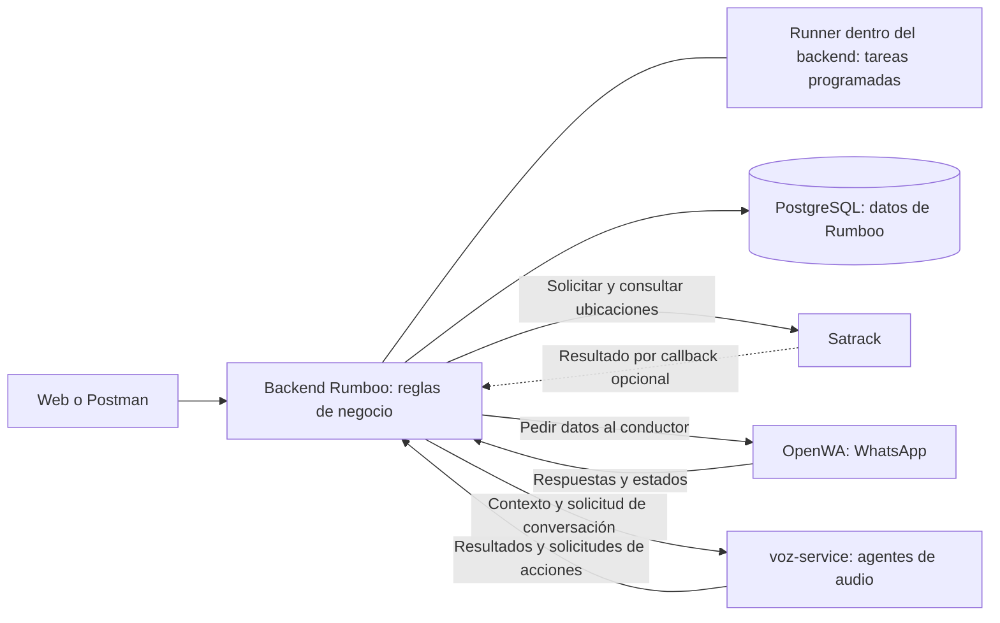

# Arquitectura ortogonal del backend de Rumboo

Arquitectura aplicada al núcleo del primer MVP · 8 de octubre de 2026 · Complementa `backend/PLAN.md`.

La prioridad de esta revisión es definir los servicios, sus responsabilidades y cómo se conectan. El runner forma parte interna del backend para ejecutar el seguimiento y las acciones programadas. El núcleo modular, las consultas satelitales recuperables y el runner están implementados; las funcionalidades restantes se implementarán por hito. Satrack conserva su implementación, configuración y despliegue.

## 1. Los cinco componentes

| Componente | Responsabilidad | Datos que entrega | Estado |
|---|---|---|---|
| **Satrack (`satrack-service`)** | Traer la ubicación de diferentes vehículos de una cuenta satelital | Lista de vehículos; placa, dirección, coordenadas, velocidad, estado y hora GPS cuando estén disponibles | Servicio existente; consumo, flota y resultados persistidos en el backend |
| **OpenWA** | Conectar WhatsApp para pedir y recibir datos del conductor | Mensajes, respuestas, fotos, audio, documentos y estado de entrega | Proveedor elegido; integración con el backend pendiente |
| **`voz-service`** | Manejar los agentes de audio y las conversaciones con el conductor | Estado de la conversación, transcripción cuando esté disponible y datos estructurados: novedades, ETA o solicitudes de seguimiento | Componente definido; implementación y proveedor de voz/IA pendientes |
| **PostgreSQL** | Guardar los datos de Rumboo y el trabajo pendiente de forma persistente | Viajes, conductores, vehículos, consultas, posiciones, mensajes, documentos, auditoría y acciones pendientes | Base de datos del backend; los modelos se amplían por hito |
| **Backend Rumboo** | Aplicar las reglas de negocio y coordinar las integraciones, con API y runner interno | Validaciones, viajes, ubicaciones, alertas, solicitudes al conductor, revisión de soportes y seguimiento automático | Núcleo modular y runner implementados; funcionalidades restantes por hito |

Los datos satelitales ausentes permanecen vacíos o `null`. La organización de `voz-service` no significa que las llamadas o los agentes ya estén implementados.

**Runner:** ejecutor interno de tareas del backend. Programa consultas, sigue jobs pendientes, aplica reintentos seguros y dispara evaluaciones, recordatorios y reportes cuando corresponda. Utiliza los casos de uso de los módulos; las reglas permanecen en sus módulos de negocio.

## 2. Cómo se conectan



El backend es el punto de coordinación. Satrack, OpenWA y `voz-service` se comunican con él mediante contratos HTTP o webhooks. No se comunican directamente entre sí ni modifican las tablas de Rumboo.

**Recorrido satelital:** petición del usuario o frecuencia configurada → backend registra la consulta → Satrack obtiene los vehículos → runner sigue el job o backend recibe el callback → valida y guarda las posiciones → API devuelve los datos persistidos.

**Recorrido WhatsApp:** solicitud del usuario, alerta o recordatorio programado → backend valida contacto y autorización y guarda la intención → runner envía mediante OpenWA → webhook devuelve respuesta/estado → backend lo asocia al conductor y viaje.

**Recorrido de voz, cuando se implemente:** backend valida el contacto y entrega contexto limitado → `voz-service` conversa mediante su agente de audio → devuelve información o solicita una acción → backend valida la acción y guarda su resultado.

## 3. Organización del repositorio y despliegue

Estructura creada. Los paquetes de voz y las carpetas externas documentan sus fronteras; sus adaptadores y servicios pendientes aún no son ejecutables.

```text
Rumboo/
├── backend/                  API y reglas de negocio
│   └── app/
│       ├── acceso/           Usuarios, sesiones y transportadoras
│       ├── operacion/        Conductores, vehículos, viajes y remesas
│       ├── satelital/        Consumo de Satrack y persistencia de ubicaciones
│       ├── mensajeria/       Consumo de OpenWA y asociación de respuestas
│       ├── voz/              Frontera documentada; cliente y validación pendientes
│       ├── documentos/       Cumplidos y revisión humana
│       ├── monitoreo/        Reglas y alertas sobre los datos obtenidos
│       ├── indicadores/      Panel y pendientes
│       ├── auditoria/        Registro de acciones
│       ├── core/             Seguridad, BD, entregas persistidas y runner (tareas.py)
│       ├── consultas.py      Composición de DTO de varios módulos, por instancia
│       └── main.py           Conecta routers, consumidores y tareas
├── satrack-service/          Servicio existente: ubicación de vehículos
├── voz-service/              Frontera documentada; agentes y adaptadores pendientes
├── infra/                    Responsabilidades y operación de servicios externos
│   ├── openwa/               Referencia a imagen/revisión y configuración de sesión
│   └── postgres/             Configuración, persistencia y respaldo de la BD
├── docs/                     Arquitectura, contratos y operación
└── compose.yaml              Servicios del entorno; voz se incorpora cuando esté implementada
```

OpenWA se consume como servicio de terceros, sin copiar su código ni agregar otro servicio propio que lo envuelva. PostgreSQL usa su imagen y volumen de datos. Las fotos, audio y PDF se guardan en un volumen privado; PostgreSQL conserva sus metadatos y referencias.

| Servicio de despliegue | Contenido | Acceso al negocio |
|---|---|---|
| `api` | Backend Rumboo: API y runner en el mismo proceso | Dueño de las tablas y reglas de Rumboo |
| `satrack` | Servicio satelital existente | Recibe cuenta/placas y devuelve vehículos y ubicaciones |
| `openwa` | Proveedor WhatsApp | Recibe mensajes y devuelve respuestas/estados |
| `voz` | `voz-service`, cuando esté implementado | Recibe contexto autorizado; devuelve información y solicita acciones al backend |
| `db` | PostgreSQL | Acceso a las tablas de Rumboo desde el backend |

OpenWA puede administrar su propia persistencia según el despliegue elegido. Esa persistencia pertenece al proveedor y no se consulta directamente desde Rumboo.

## 4. Límites que mantienen la ortogonalidad

| Componente | Se encarga de | Delega al backend |
|---|---|---|
| Satrack | Acceso satelital y lectura de vehículos/ubicaciones | Asociación a viajes, historial operativo, reglas y alertas |
| OpenWA | Conexión y transporte de mensajes de WhatsApp | Qué pedir, a quién, autorización, asociación y uso de la respuesta |
| `voz-service` | Agentes de audio, contexto conversacional e interpretación de respuestas | Permisos, transiciones, validación de acciones y persistencia del negocio |
| PostgreSQL | Persistencia, transacciones, restricciones e índices | Decisiones de negocio y coordinación de servicios |
| Backend | Reglas, autorización, estados y coordinación | Lectura satelital, transporte de WhatsApp y ejecución de agentes de audio a sus servicios |

Los clientes externos del backend se concentran en `satelital/cliente.py`, `mensajeria/openwa.py` y el futuro `voz/cliente.py`. Traducen los formatos externos a datos propios de Rumboo.

Dentro del backend, cada módulo modifica únicamente sus tablas y expone funciones y datos validados. Los módulos no comparten entidades ORM mutables. Las operaciones que combinan módulos se conectan explícitamente en la composición de la aplicación, sin dependencias circulares ni registros globales de proveedores.

El estado operativo pertenece a operación, la aprobación documental a documentos y la futura confirmación RNDC a su integración. Un agente de audio puede solicitar registrar una novedad o actualizar una ETA; el backend decide si esa acción es válida. La aprobación de documentos sigue siendo humana.

## 5. Ejecución del primer MVP con runner

El runner arranca y se detiene con el backend. `core/tareas.py` recibe funciones de los módulos mediante la composición, sin depender de FastAPI ni importar reglas de negocio. Cada ejecución usa su propia sesión de BD. Al inicio hay un único ejecutor, dentro del proceso de la API.

| Tarea | Responsabilidad y frecuencia | Estado |
|---|---|---|
| Programar consultas | Revisar cuentas cada 60 s y consultar viajes elegibles cada 5–10 min según configuración; una consulta pendiente por cuenta | Implementada |
| Seguir jobs Satrack | Consultar el GET existente cada 5 s mientras el job siga pendiente, incluso sin callback | Implementada |
| Evaluar reglas | Al recibir posiciones y cada 60 s para reglas que dependen del tiempo; un fallo del proveedor no implica pérdida de señal del vehículo | Pendiente M3 |
| Entregar eventos internos | Consumir `entregas_pendientes` cada 2 s; aplicar cambios de BD y confirmar entrega en la misma transacción | Implementada |
| Enviar mensajes y avisos | Guardar intención, ejecutar HTTP fuera de transacciones y reconciliar aceptación/entrega | Pendiente M3 |
| Recordatorios y reportes | Según configuración y consentimiento, desde los hitos de WhatsApp y reportes; voz solo cuando se implemente su integración | Pendiente M3/M4 y voz |

Las consultas se guardan antes del POST a Satrack. El callback y el GET convergen en un procesamiento idempotente. Un POST incierto se reconcilia antes de declarar fallo; si el UUID desaparece, se reenvía la consulta todavía vigente con reintentos acotados. Tras 240 s desde el primer POST se registra el fallo una sola vez, pero antes se consulta el GET: un resultado listo se aplica aunque la API haya estado detenida más tiempo. Un resultado tardío de una consulta vencida o cancelada solo aporta historial. Un cambio de credenciales invalida efectos antiguos y las respuestas tardías no se asignan a un nuevo viaje.

Los eventos internos se guardan en `entregas_pendientes` junto al cambio de negocio. Cada consumidor tiene nombre estable, clave de deduplicación, intentos y reclamación con vencimiento. Su efecto en BD y la confirmación se guardan juntos; las reclamaciones vencidas se recuperan, hasta cinco intentos. El consumidor satelital reserva una consulta; el HTTP posterior se ejecuta fuera de la transacción. En M3 los envíos OpenWA tendrán su estado propio y deberán distinguir aceptación de entrega y reconciliar envíos inciertos según el contrato real del proveedor.

**Recuperación:** PostgreSQL conserva las consultas y acciones pendientes. Después de reiniciar, el runner retoma su seguimiento sin que el usuario tenga que abrir la Web. Las reclamaciones vencidas se recuperan y los efectos se deduplican. No se promete ejecución exactamente una vez.

**Control operativo:** el ejecutor mantiene y comprueba un advisory lock en una conexión dedicada; si la pierde, detiene nuevas reclamaciones hasta recuperar liderazgo. Cada tarea informa último intento, último éxito y error en `/health`. Los fallos de una integración no detienen las demás tareas.

El trabajo periódico y los efectos pendientes usan PostgreSQL en el MVP, sin Redis, Celery ni otro servicio desplegable. Si después se necesita un proceso worker, reutilizará los mismos casos de uso y requerirá ajustar composición, configuración y salud compartida.

## 6. Orden de trabajo

1. **Organizar componentes y contratos:** implementado en esta entrega. Responsabilidades de los cinco componentes, entradas/salidas y separación entre servicios externos y negocio.
2. **Backend + Satrack y runner:** implementados flota completa como lista de objetos, resultados persistidos, consultas periódicas y recuperación tras reinicio. Nuevo GET autenticado `/api/consultas-satelitales/{job_id}`. Migración `847a65cf24dd` separa el estado satelital y conserva ubicaciones previas. Importación Excel por manifiesto con plantilla, catálogos paginados y `GET /api/configuracion`. `scripts/demo_m1.py` reproduce el resultado verificable de M1 con procesos reales.
3. **Cumplido manual:** soportes privados por remesa, versiones, aprobación/rechazo y pendientes.
4. **Integrar OpenWA:** solicitar datos del conductor, recibir/asociar sus respuestas y soportes, y ejecutar recordatorios con deduplicación y consentimiento.
5. **Implementar `voz-service`:** después de elegir proveedor de voz/IA y fijar su contrato; agentes de audio dentro del servicio y acciones validadas por el backend.

La extracción automática y RNDC siguen pendientes. Esta entrega modifica el backend y organiza las carpetas externas; no despliega servicios nuevos.

## 7. Verificación de las fronteras

El núcleo se prueba sobre PostgreSQL real con un cliente falso de Satrack. OpenWA, voz, documentos y sus pruebas se incorporarán con sus hitos. Las pruebas comprueban aislamiento entre transportadoras, contratos de datos, respuestas duplicadas, errores externos, recuperación automática tras reinicio, flota completa y conservación de ubicaciones en la migración. La aprobación por versión se probará en M2. El runner se prueba sin construir FastAPI: liderazgo, reclamaciones vencidas, reintentos y aislamiento de fallos. Las importaciones entre módulos deben conservar sus fronteras; los servicios de negocio no dependen de FastAPI.

Cambiar el formato de OpenWA afecta su adaptador y pruebas de contrato; cambiar una regla afecta el módulo de negocio; cambiar el proveedor de audio afecta `voz-service`. Los consumidores se mantienen mientras se conserve el contrato acordado.

## 8. Aplicación y límites de esta entrega

Ejecutar desde `backend/`: `uv run alembic upgrade head` antes de iniciar la API. La migración conserva presencia y última posición de vehículos vinculados a una cuenta; los jobs existentes se concilian antes de repetir un POST. No se aplicó a una BD operativa ni se reinició Satrack.

`SCHEDULER_ENABLED=true` habilita el runner. Frecuencias: `SCHEDULER_INTERVAL_S=60`, `RECONCILIATION_INTERVAL_S=5`, `EVENTOS_INTERVAL_S=2`; comprobación de liderazgo `RUNNER_LOCK_CHECK_S=1`. `/health` muestra tareas y conteos de entregas.

Si se acumulan entregas `fallido`, requieren revisión de su consumidor; no se reactivan indefinidamente. El runner vive con la API: apagar todo el backend pausa el seguimiento hasta su siguiente arranque. El proceso independiente y la salud compartida entre réplicas quedan para cuando el volumen los justifique.
