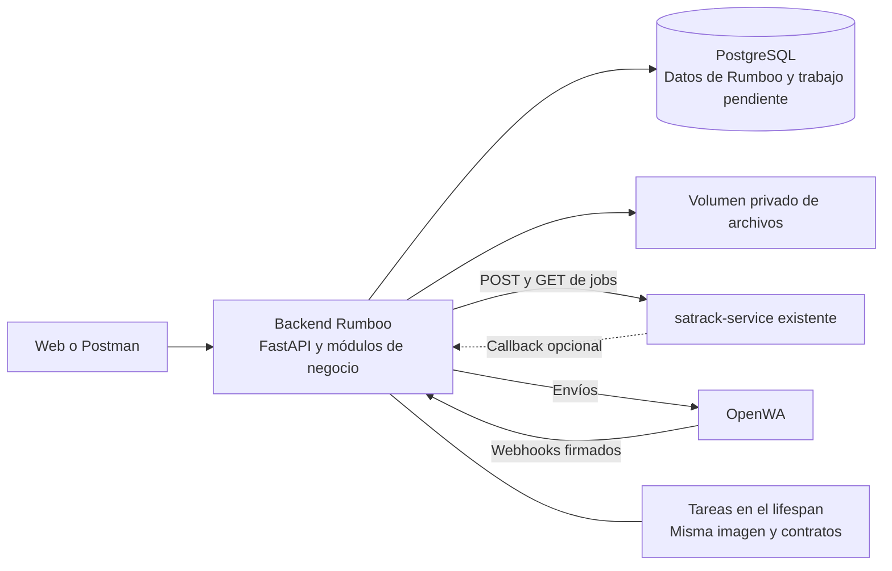
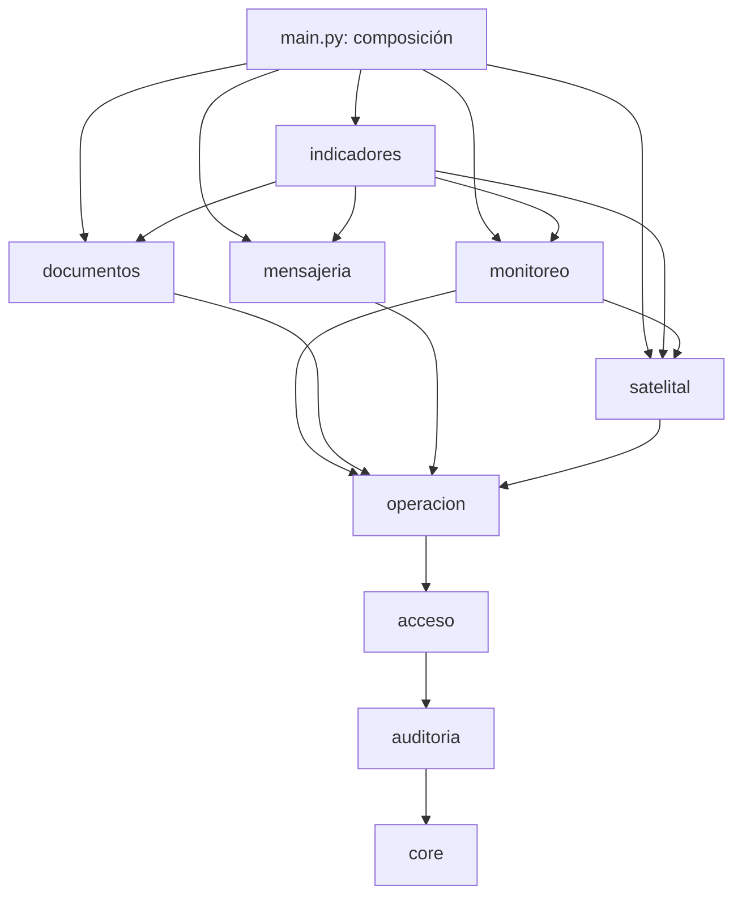

# Arquitectura ortogonal del backend de Rumboo

Diseño propuesto · 8 de octubre de 2026 · Complementa `backend/PLAN.md`.

Este documento define fronteras y contratos para las siguientes entregas. Las carpetas presentes en el árbol de trabajo son una separación inicial; no acreditan que estén implementadas la reconciliación, la cola persistente, WhatsApp o los cumplidos. El microservicio Satrack conserva su código, configuración, endpoints y despliegue.

## 1. Qué significa ortogonalidad en Rumboo

Un cambio debe quedar contenido en el módulo responsable mientras conserve su contrato público. Cambiar el transporte de WhatsApp afecta su adaptador y sus pruebas; cambiar una regla de detención afecta monitoreo; cambiar el almacenamiento de fotos afecta el adaptador de archivos.

Las dependencias de negocio siguen existiendo: un cumplido pertenece a una remesa y una alerta pertenece a un viaje. La arquitectura hace esas dependencias explícitas y limita cómo se usan. Separar carpetas o procesos, por sí solo, no garantiza independencia.

## 2. Unidades desplegables



| Unidad | Responsabilidad | Decisión |
|---|---|---|
| Backend | Datos de Rumboo, autorización, viajes, documentos, reglas y acciones pendientes | Un monolito modular con FastAPI |
| Satrack | Acceso a Satrack mediante navegador y entrega de resultados | Servicio existente; integración HTTP desde el backend |
| OpenWA | Transporte y sesión de WhatsApp | Servicio de terceros; adaptador en mensajería |
| Runner | Programar, reconciliar y ejecutar trabajo pendiente | Inicialmente dentro de la API; preparado para ejecutarse por separado |
| PostgreSQL | Estado operativo durable | El backend es dueño de las tablas de Rumboo |
| Archivos | Contenido privado de fotos, audio y PDF | Volumen privado en el piloto; acceso mediante un adaptador |

OpenWA administra su propia persistencia según su despliegue. Rumboo no consulta ni modifica sus tablas: únicamente su API y sus webhooks. No se agrega un microservicio propio que solo envuelva OpenWA.

Se reconsidera una separación cuando haga falta aislar fallos, escalar de forma independiente o ejecutar otro runtime y exista un contrato estable. Voz en tiempo real puede justificar un servicio de transporte de audio; su proveedor y su implementación siguen pendientes.

## 3. Módulos y propiedad de los datos

| Módulo | Modelos de los que es dueño | Operaciones públicas |
|---|---|---|
| `acceso` | Transportadora, Usuario, Sesion | Autenticar, revocar sesión, resolver contexto y configuración de la empresa |
| `operacion` | Conductor, Vehiculo, Viaje, Remesa | Registrar/importar viajes, reservar recursos, verificar consentimiento y cambiar estado operativo |
| `satelital` | CuentaSatelital, ConsultaSatelital, VehiculoSatelital, Posicion | Sincronizar flota, reservar consultas, aplicar resultados, consultar última ubicación e historial |
| `documentos` | ArchivoPrivado, Cumplido, VersionCumplido y asociación de archivos | Guardar soportes, crear versiones, validar datos y revisar una versión concreta |
| `mensajeria` | CanalWhatsApp, Mensaje | Recibir, asociar y enviar mensajes; consultar sesión e historial |
| `monitoreo` | PuntoControl, Alerta, Novedad; RutaViaje en M4 | Evaluar reglas, abrir/atender/cerrar alertas y registrar novedades |
| `indicadores` | Reporte en M4 | Leer resúmenes, pendientes y antigüedad; generar reportes |
| `auditoria` | Evento | Registrar hechos con actor, entidad, motivo y fecha; solo inserción |
| `core` | EntregaPendiente y registro técnico de recepción cuando se implementen | Sesiones de BD, configuración, errores, seguridad y ejecución durable |

`agentes` solo tendrá acciones y contexto de ejecución cuando se defina una integración de IA. Los agentes consumirán operaciones de negocio con permisos explícitos. La futura transmisión RNDC tendrá un módulo dueño de sus transmisiones; no será propiedad de un agente.

Hay tres estados distintos: **operativo**, propiedad de operación; **documental**, propiedad de documentos; y **confirmación RNDC**, pendiente de su integración. El resumen puede combinarlos, pero cada módulo modifica únicamente su estado. Detectar llegada no entrega el viaje, aprobar una foto no confirma RNDC y un fallo de WhatsApp no revierte la aprobación.

### Contrato de una carpeta

```text
<modulo>/
├── __init__.py       Responsabilidad y API pública documentadas
├── models.py         Tablas privadas del módulo
├── schemas.py        Entradas, resultados y eventos propios, validados
├── servicio.py       Casos de uso mediante funciones
├── router.py         HTTP, autenticación y traducción de respuestas
├── enlaces.py        Tareas y suscriptores que registra la composición, si hacen falta
└── <adaptador>.py     Cliente externo, solo cuando ese módulo lo necesite
```

Las clases se reservan para adaptadores con recursos o configuración, como el cliente HTTP y el almacenamiento, y para estructuras de datos. No se agregan clases base de servicio, repositorios universales ni carpetas vacías para capacidades pendientes.

## 4. Dependencias permitidas

Las flechas indican «puede usar la API pública de». `core` no importa módulos de negocio y la raíz de composición conecta las piezas.



Todos los módulos pueden usar las utilidades de `core`, el contexto público de acceso y el registro público de auditoría. Documentos, mensajería y monitoreo son independientes entre sí: sus reacciones se conectan mediante eventos. Los indicadores consultan servicios de lectura y no modifican la operación.

Las fronteras se aplican así:

1. Otro módulo importa únicamente `servicio` y `schemas`. Los `models` son privados, salvo el registro de metadatos de SQLAlchemy/Alembic.
2. Una operación pública devuelve datos validados —por ejemplo `ViajeResumen`, `VehiculoResumen` o `PosicionDTO`—, nunca entidades ORM mutables. Prohibir el import de `models` no basta si un servicio devuelve esos objetos.
3. Una referencia entre módulos usa identificadores y contexto de transportadora. Puede conservar una FK en PostgreSQL sin compartir clases ORM ni permitir escrituras ajenas.
4. La raíz de composición inyecta clientes, tareas y suscriptores por instancia. No hay registro global mutable de proveedores ni dependencias implícitas entre aplicaciones.
5. Los servicios no reciben `Request`, no usan `app.state` y no lanzan `HTTPException`. Los routers traducen errores de dominio a HTTP.
6. `satelital/cliente.py`, `mensajeria/openwa.py` y `documentos/almacenamiento.py` concentran los formatos y particularidades de sus proveedores. Sus cambios se validan con pruebas de contrato.

Para devolver un vehículo con su ubicación, una función de consulta enlazada en la composición combina el resumen de operación con la ubicación de satelital, por lotes. Operación no instala callbacks globales ni entrega su entidad ORM al proveedor satelital. Se conserva el contrato HTTP mientras se cambia su implementación interna.

## 5. Transacciones, eventos y tareas

### Operación inmediata

Un caso de uso tiene una sola transacción. Las funciones subordinadas reciben la sesión y no hacen commits ocultos. El punto que ejecuta el caso de uso confirma o revierte una vez. Las invariantes inmediatas, como la reserva de un vehículo, se protegen con restricciones y bloqueos en PostgreSQL.

Una reacción de negocio que puede ejecutarse después queda pendiente en la misma transacción que el cambio que la origina. La comunicación externa ocurre después del commit y fuera de bloqueos de negocio. Ninguna sesión SQLAlchemy se comparte entre tareas concurrentes; cada ejecución abre la suya.

### Trabajo durable

`EntregaPendiente` representa una entrega a un destinatario concreto, con UUID, transportadora, tipo y versión del evento, datos validados, clave de deduplicación, estado, intentos, próxima ejecución y vencimiento de la reclamación. Los datos no contienen contraseñas ni archivos completos.

1. El productor guarda el cambio y las entregas a los consumidores registrados en una misma transacción.
2. El runner reclama trabajo con un bloqueo breve y confirma la reclamación.
3. El consumidor interno aplica sus cambios y confirma la entrega de forma atómica en PostgreSQL. Una acción externa se ejecuta fuera de la transacción y su resultado se registra después.
4. Si muere el proceso, el vencimiento de la reclamación permite recuperar el trabajo. Cada consumidor reconoce su clave de deduplicación; un reintento no repite el efecto.

Es el patrón [transactional outbox](https://docs.aws.amazon.com/prescriptive-guidance/latest/cloud-design-patterns/transactional-outbox.html): guardar el dato y la intención de notificar juntos evita perder la reacción entre un commit y un reinicio. No exige incorporar un broker.

La auditoría conserva lo que ocurrió; el outbox conserva lo que falta entregar. Son registros diferentes. El bus en memoria puede acelerar el despertar del runner o invalidar caché; las acciones necesarias para el negocio se recuperan desde la BD.

| Origen | Evento durable | Consumidor y efecto |
|---|---|---|
| Operación | `viaje_registrado.v1` | Satelital verifica la placa o reserva su consulta |
| Satelital | `flota_verificada.v1` | Un enlace invoca la operación pública que incorpora vehículos y programa viajes elegibles |
| Satelital | `posiciones_actualizadas.v1` | Monitoreo evalúa los viajes afectados |
| Operación | `viaje_entregado.v1` | Documentos inicia el pendiente de cada remesa |
| Monitoreo | `alerta_abierta.v1` | Mensajería prepara un aviso autorizado |
| Documentos | `solicitud_soporte.v1` | Mensajería registra un mensaje de salida |
| Mensajería | `soporte_recibido.v1` | Un enlace entrega el archivo a documentos; ante ambigüedad queda para asociación humana |

El destinatario y su función se registran explícitamente en la composición. No hay descubrimiento dinámico de handlers. Los eventos llevan ID, versión de entidad cuando importe el orden, fecha UTC y transportadora autenticada. Un evento atrasado no revierte un estado nuevo; se consulta el estado vigente o se rechaza la versión obsoleta.

### Runner y recuperación

`core/tareas.py` recibe funciones y recursos, sin importar FastAPI ni módulos de negocio. El lifespan lo inicia y lo detiene. La programación satelital y la reconciliación son tareas separadas: programar según frecuencia de la cuenta y revisar pendientes cada cinco segundos.

El líder mantiene un advisory lock en una conexión dedicada. Debe comprobar su vigencia y detener reclamaciones si pierde esa conexión; no basta adquirirlo al arrancar. PostgreSQL mantiene el [lock de sesión](https://www.postgresql.org/docs/16/explicit-locking.html#ADVISORY-LOCKS) mientras esa sesión existe. Los leases y la deduplicación también protegen la recuperación del trabajo.

El heartbeat distingue última ejecución de último éxito y muestra errores/atraso por tarea. Al separar el worker se comparte ese estado por BD; apagar el runner de la API evita competir por el liderazgo. La lógica de negocio se reutiliza, pero el cambio también requiere configuración, supervisión y una prueba de reinicio.

## 6. Contratos de las integraciones

### Satrack: estado persistido en Rumboo

Satelital crea `ConsultaSatelital` en PostgreSQL antes del POST. Guarda UUID, cuenta y versión de credenciales, placas, relación placa-viaje al solicitar, estado, intentos y plazos. Las credenciales se descifran únicamente al preparar la llamada.

`GET /v1/jobs/{job_id}` y el callback convergen en `aplicar_resultado`. Esa operación valida, conserva el resultado completo sin secretos y actualiza posiciones y datos satelitales de forma idempotente. Conserva dirección, coordenadas, velocidad, estado y hora GPS disponibles, y todos los vehículos como una colección de objetos. `partial` no convierte una omisión en ausencia confirmada.

Un POST con resultado incierto se reconcilia antes de declarar fallo. Si el scraper desconoce el UUID y la consulta sigue vigente, se reenvía con el mismo UUID y reintentos acotados. Un cambio de credenciales invalida los efectos de la versión anterior. Las respuestas tardías no se asignan al nuevo viaje del mismo vehículo y cada fallo se cuenta una sola vez.

`VehiculoSatelital` guarda alias, identificador del proveedor, presencia y referencia de última posición. `operacion.Vehiculo` conserva placa y datos del negocio. Esta migración evita que Satrack escriba sus estados dentro de operación.

### OpenWA: intención, aceptación y entrega

Mensajería guarda primero el mensaje y la intención de envío. El adaptador usa una clave estable y mapea respuesta, ACK, error y firma a estados propios. Se distinguen pendiente, aceptado por el proveedor, entregado, leído, fallido e incierto.

La [especificación consultada de OpenWA](https://github.com/rmyndharis/OpenWA/blob/main/docs/06-api-specification.md#idempotent-sends) admite `Idempotency-Key` en envíos individuales con una ventana de 24 horas y un resultado de entrega incierto. Se verificará contra la revisión desplegada. Ante incertidumbre se reconcilia o solicita revisión; una clave vencida no autoriza un reenvío automático.

El webhook se autentica sobre el cuerpo original y se registra antes de responder éxito. Se deduplica por la clave del evento; las actualizaciones de entrega se distinguen del mensaje original. Los archivos se conservan en almacenamiento privado mediante una operación enlazada en la composición. Mensajería recibe un ID de archivo, sin escribir tablas de documentos ni conocer el disco.

Cambiar OpenWA por otro proveedor puede exigir adaptar autenticación, recepción y capacidades de envío. El objetivo es conservar los contratos de Rumboo; no se promete que cualquier proveedor se sustituya cambiando literalmente un archivo.

### Geometría y documentos

Se mantienen GeoJSON y puntos manuales, sin PostGIS. `geo.py` convierte las coordenadas al sistema métrico adecuado antes de medir corredores con Shapely; para distancias entre puntos puede usar haversine. Shapely trabaja en un [plano cartesiano y no transforma coordenadas](https://shapely.readthedocs.io/en/stable/manual.html#coordinate-systems). Los umbrales en kilómetros no se comparan directamente con grados.

Las reglas reciben snapshots y devuelven hallazgos; no leen BD ni envían mensajes. Se recalculan desde posiciones persistidas, sin `EstadoMonitoreo` en el piloto. Señal perdida también necesita una tarea por tiempo: no puede depender de la llegada de otra posición. Las muestras repetidas, antiguas o incompletas no producen evidencia nueva.

Una versión documental guarda su decisión, revisor, motivo y fecha; crear otra versión exige una nueva revisión. Los archivos se escriben antes de confirmar referencias en BD; los archivos huérfanos de una operación abortada se pueden limpiar. El almacenamiento y PostgreSQL no comparten una transacción.

Los días hábiles se estiman con calendario colombiano, zona `America/Bogota` y versión definida de la librería `holidays`. No se presentan como cumplimiento normativo hasta validar la definición aplicable.

## 7. Construcción y pruebas de independencia

| Hito | Resultado | Frontera que debe quedar comprobada |
|---|---|---|
| M1: núcleo y Satrack | Flota completa, consulta persistida, ubicación e historial sin callback | DTO entre dominios, propiedad satelital separada, verificación recuperable, API reiniciada con job en curso |
| M2: cumplido manual | Soporte por remesa; rechazar v1 y aprobar v2; pendientes actualizados | Documentos funciona con almacenamiento falso y sin WhatsApp; aprobación de una versión concreta |
| M3: WhatsApp y alertas | Contacto autorizado, soporte recibido, alertas y recordatorios | Outbox de mensajes/eventos, recepción durable, duplicados e incertidumbre de envío |
| M4: rutas y reportes | Desvío, avance, ETA con evidencia y resumen periódico | Reglas puras con medidas en metros; reporte independiente del proveedor de mensajería |

Voz, extracción automática y RNDC siguen pendientes. No se crean nuevos modelos, SDK ni endpoints simulados para aparentar esas integraciones.

Las pruebas arrancan en M1. `import-linter` valida dependencias sin ciclos, independencia de módulos hermanos, privacidad de todos los `models` y aislamiento de FastAPI. Los contratos se amplían cuando aparezca cada módulo. Las pruebas de contrato verifican además que las APIs internas devuelvan DTO y no ORM: los imports por sí solos no lo demuestran.

Se verifican sobre PostgreSQL aislamiento entre transportadoras, carreras, migraciones, duplicados, recuperación de reclamaciones y rollback sin entrega de eventos. El runner se prueba sin construir FastAPI. Los adaptadores falsos permiten probar negocio sin Satrack ni OpenWA; las pruebas reales se ejecutan aparte, consumiendo sus contratos existentes.

Ejemplos de cambios que deben quedar contenidos:

| Cambio | Componentes que deberían requerir modificación |
|---|---|
| Regla de detención de 60 a 45 minutos | Parámetros y pruebas de monitoreo |
| Cambio del formato HTTP de OpenWA | Adaptador de mensajería y pruebas de contrato |
| Pasar fotos del disco a almacenamiento de objetos | Adaptador y configuración de archivos; pruebas de contrato |
| Ejecutar tareas en otro proceso | Composición del worker, heartbeat compartido, configuración y pruebas de recuperación |
| Añadir un dato satelital | Traducción del adaptador y contrato satelital; consumidores solo si utilizan el dato |

## 8. Diferencias respecto de la separación inicial

La siguiente implementación debe resolver cuatro fronteras que las carpetas actuales todavía no garantizan:

- APIs públicas que exponen ORM y registros globales de extensiones: sustituirlos por DTO y composición por instancia.
- Bus después del commit en memoria: las reacciones necesarias pasan a entregas persistidas; el bus solo acelera su ejecución.
- Presencia y última posición dentro del vehículo operativo: trasladarlas a `VehiculoSatelital` sin renombrar ni borrar tablas existentes.
- Liderazgo adquirido una sola vez y heartbeat sin distinguir éxito: comprobar conexión/lock y registrar resultado por tarea.

Estas son tareas del backend. El documento no autoriza cambios en el microservicio Satrack.
